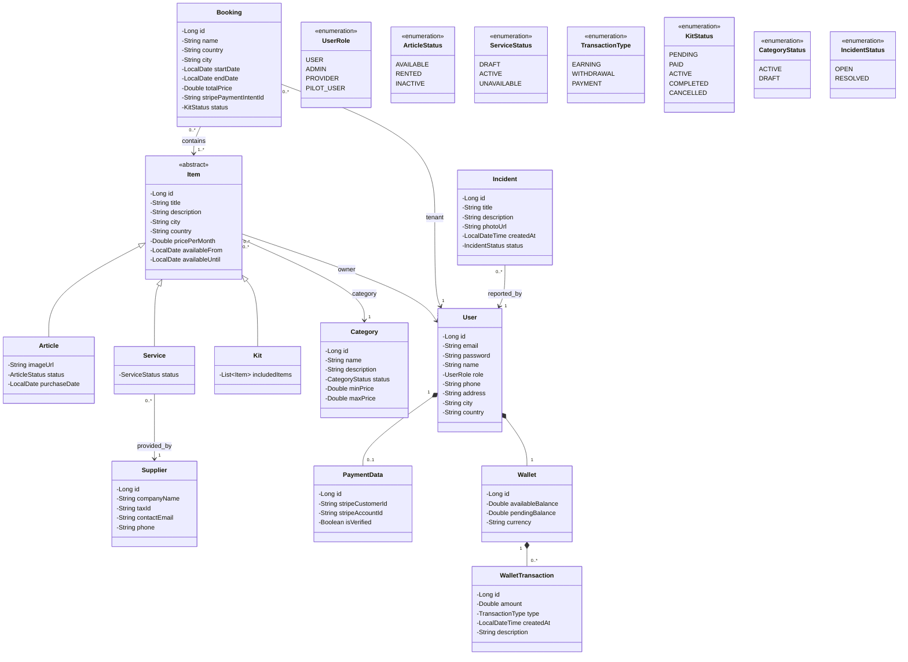

# Diagrama de clases UML

## Historial de versiones

| Versión | Fecha      | Descripción                         | Autor(es)                |
| ------- | ---------- | ----------------------------------- | ------------------------ |
| 1.0.0   | 25/02/2026 | Versión inicial del diagrama        | José Luis Moraza Vergara |
| 2.0.0   | 28/02/2026 | Añadidas clases Incident y Category | José Luis Moraza Vergara |

---

**Redactado y realizado por:** José Luis Moraza Vergara  
**Fecha:** 28/02/2026  
**Versión:** 2.0.0
