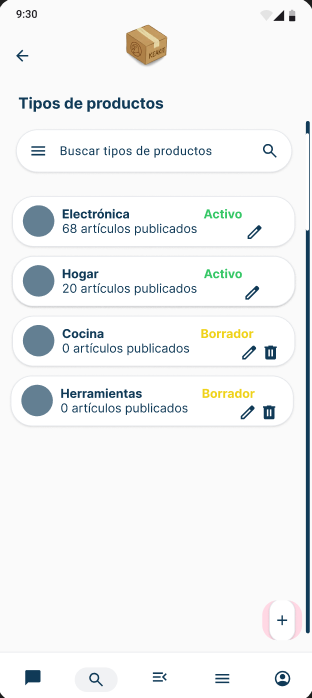

# Mockups

## Índice

1. [Introducción](#1-introducción)
2. [Mockups generales](#2-mockups-generales)  
   2.1. [Registro e inicio de sesión - Core](#21-registro-e-inicio-de-sesión---core-cu-general-01)  
   2.2. [Gestión de datos personales - Core](#22-gestión-de-datos-personales---core-cu-general-02cu-general-03)  
   2.3. [Home - No Core](#23-home---no-core-cu-general-05)
3. [Mockups arrendador](#3-mockups-arrendador)  
   3.1. [Subir artículos - Core](#31-subir-artículos---core-cu-arrendador-01)  
   3.2. [Perfil / Mis artículos - Core](#32-perfil--mis-artículos---core-cu-arrendador-02)  
   3.3. [Filtrado de mis artículos - No Core](#33-filtrado-de-mis-artículos---no-core-cu-arrendador-07)  
   3.4. [Edición de detalles de un artículo - Core](#34-edición-de-detalles-de-un-artículo---core-cu-arrendador-03)  
   3.5. [Cartera - Semi Core](#35-cartera---semi-core-cu-arrendatario-04cu-arrendador-05)  
   3.6. [Gestión fin alquiler - No Core](#36-gestión-fin-alquiler---no-core-cu-arrendador-04)  
   3.7. [Notificaciones arrendador - No Core](#37-notificaciones-arrendador---no-core-cu-arrendador-06cu-arrendador-08)  
   3.8. [Consulta de alta demanda - No Core](#38-consulta-de-alta-demanda---no-core-cu-arrendador-09)
4. [Mockups Arrendatario](#4-mockups-arrendatario)  
   4.1. [Crear un kit - Core](#41-crear-un-kit---core-cu-arrendatario-01cu-arrendatario-02)  
   4.2. [Añadir Productos a un Kit - Core](#42-añadir-productos-a-un-kit---core-cu-arrendatario-01cu-arrendatario-02)  
   4.3. [Edición artículo en kit - Core](#43-edición-artículo-en-kit---core-cu-arrendatario-01cu-arrendatario-03)  
   4.4. [Pago - Core](#44-pago---core-primera-versión-cu-arrendatario-04)  
   4.5. [Perfil / Mis kits - Core](#45-perfil--mis-kits---core-cu-arrendatario-05)  
   4.6. [Detalles kit - Core](#46-detalles-kit---core-cu-arrendatario-02cu-arrendatario-05)  
   4.7. [Aviso disponibilidad - No Core](#47-aviso-disponibilidad---no-core-cu-arrendatario-09)  
   4.8. [Ampliación de búsqueda - No Core](#48-ampliación-de-búsqueda---no-core-cu-arrendatario-10)
5. [Mockups Administrador](#5-mockups-administrador)  
   5.1. [Gestión categorías - Core](#51-gestión-categorías---core-cu-admin-01)  
   5.2. [Detalles tipo productos/categorías - Core](#52-detalles-tipo-productoscategorías---core-cu-admin-01)  
   5.3. [Edición tipo productos/categorías - Core](#53-edición-tipo-productoscategorías---core-cu-admin-01)  
   5.4. [Gestión usuarios - Semi Core](#54-gestión-usuarios---semi-core-cu-admin-02cu-admin-04)  
   5.5. [Configuración modelo de negocio - No Core](#55-configuración-modelo-de-negocio---no-core-cu-admin-05)
6. [Historial de versiones](#6-historial-de-versiones)

## 1. Introducción

En este apartado, se van a presentar los mockups de nuestra aplicación, Keakit, en formato móvil, con el fin de acercar su diseño a todo posible interesado en la misma.

Para ello, en primer lugar debemos tener en cuenta que nuestra aplicación cuenta con tres roles internos definidos:

- **Arrendador**: Aquel que pone objetos de su propiedad o servicios en alquiler.
- **Arrendatario**: Aquel que alquila kits, artículos individuales o servicios.
- **Administrador**: Aquel que se encarga de la administración de la aplicación.

A efectos prácticos, se ha decidido finalmente que solo existan dos roles `USER` (que hará de arrendador y arrendatario desde un mismo perfil) y `ADMIN`.

En el siguiente enlace, se puede acceder al prototipo funcional de la aplicación: [Prototipo funcional inicial](https://keakit-prototype.netlify.app/)

En caso de querer empezar la navegación desde 0, pulsar sobre el logo de la aplicación en cualquiera de las pantallas (borrará los datos registrados en el navegador, para poder reiniciar el prototoipo).

## 2. Mockups Generales

En primer lugar, nos centramos en aquellas pantallas que están generalizadas para todos los tipos de usuario, con diferencias mínimas en función del rol.

### 2.1. Registro e Inicio de sesión - Core ([CU-GENERAL-01](./casos-de-uso-core.md#11-cu-general-01-registro-e-inicio-de-sesión))

Esta es la pantalla que se mostrará al entrar en el perfil por primera vez, en ella los usuarios de la aplicación podrán registrarse. En esta pantalla se deberán rellenar los datos correspondientes y pulsar el botón **"Registrarse"** para completar el registro.

  
  

Esta pantalla corresponde al inicio de sesión en la aplicación. Tras completar los datos, se nos conducirá a la pantalla de **Home** de la aplicación. Los administradores ya estarán registrados previamente.

  

---

### 2.2. Gestión de datos personales - Core ([CU-GENERAL-02](./casos-de-uso-core.md#12-cu-general-02-gestión-de-datos-personales)/[CU-GENERAL-03](./casos-de-uso-core.md#13-cu-general-03-valoraciones))

Al acceder desde la pantalla anterior a la edición del perfil mediante el lápiz, nos encontramos con la siguiente pantalla:

  

En esta pantalla también podremos observar el nivel de valoración de los usuarios a nuestro perfil.

---

### 2.3. Home - No Core ([CU-GENERAL-05](./casos-de-uso-no-core.md#11-cu-general-05-home))

Esta pantalla representa la pantalla de inicio de la aplicación. Cada tipo de usuario tiene la suya propia, con un diseño personalizado, adaptado al rol.

  
    

## 3. Mockups Arrendador

Centrándonos en el primer rol interno mencionado, el Arrendador, se presentan los siguientes mockups.

### 3.1. Subir artículos - Core ([CU-ARRENDADOR-01](./casos-de-uso-core.md#21-cu-arrendador-01-subida-de-artículos))

Desde la pantalla de [**Home**](#23-home---no-core-cu-general-05) mencionada anteriormente, y desde la gran mayoría de las pantallas de la aplicación, se podrá pulsar el icono **"+"**, que nos llevará a la pantalla desde la que se podrán rellenar los datos para subir un artículo que queramos poner en alquiler.

  
  

---

### 3.2. Perfil / Mis artículos - Core ([CU-ARRENDADOR-02](./casos-de-uso-core.md#22-cu-arrendador-02-listado-de-artículos-subidos))

En la barra de navegación, encontraremos un icono correspondiente al perfil del usuario, si entramos, accederemos a la pantalla donde podremos ver nuestros datos de usuario como arrendador, junto con el listado de artículos que tenemos subidos para su alquiler. Desde aquí, también podremos acceder a la edición de nuestro perfil (mediante el icono del lápiz), a nuestra cartera (mediante el botón con este mismo nombre), y a la edición de aquellos artículos que actualmente no están alquilados por ningún usuario arrendatario (mediante el lápiz en cada uno de los artículos).

  

En caso de que alguno de los artículos que tenemos subidos a la aplicación estén alquilados en ese momento, nos aparecerá un cartel que nos lo indicará claramente, junto con la fecha de finalización del alquiler en curso.

Si pulsamos sobre los artículos que encontramos en la sección "Mis artículos", accederemos a los detalles del mismo, en una pantalla como la que se muestra a continuación.

  

Desde esta pantalla podremos acceder también a la pantalla de edición del artículo, o podremos eliminar el artículo.

---

### 3.3. Filtrado de mis artículos - No Core ([CU-ARRENDADOR-07](./casos-de-uso-no-core.md#24-cu-arrendador-07-filtros-en-mis-artículos))

Además de lo anterior, se podrá realizar un filtrado por distintos aspectos como el precio, la categoría, etc. La sección de filtrado tendrá el siguiente aspecto:

  

---

### 3.4. Edición de detalles de un artículo - Core ([CU-ARRENDADOR-03](./casos-de-uso-core.md#23-cu-arrendador-03-gestión-de-artículos-subidos))

Al acceder a la edición de los detalles de un artículo, se nos muestra la siguiente pantalla:

  

Desde aquí, podremos editar cualquiera de los atributos asociados al artículo.

---

### 3.5. Cartera - Semi Core ([CU-ARRENDATARIO-04](./casos-de-uso-core.md#34-cu-arrendatario-04-pago-del-kit)/[CU-ARRENDADOR-05](./casos-de-uso-no-core.md#22-cu-arrendador-05-retirada-de-ingresos))

Como ya se ha mencionado, como arrendador, se podrá acceder a la cartera, desde donde se podrán revisar todos los movimientos del cliente en la aplicación, tanto los ingresos por alquiler, como las retiradas a su cuenta bancaria. La cartera viene representada por la siguiente pantalla:

  

---

### 3.6. Gestión fin alquiler - No Core ([CU-ARRENDADOR-04](./casos-de-uso-no-core.md#21-cu-arrendador-04-gestión-de-fin-de-alquiler))

A esta pantalla se podrá acceder tras cierto tiempo después del fin de alquiler de un artículo, entrando en los detalles del artículo. Desde ella se deberá confirmar la devolución del artículo (o no) y si el estado en que se ha devuelto es óptimo.

  

---

### 3.7. Notificaciones arrendador - No Core ([CU-ARRENDADOR-06](./casos-de-uso-no-core.md#23-cu-arrendador-06-alertas-de-demanda)/[CU-ARRENDADOR-08](./casos-de-uso-no-core.md#25-cu-arrendador-08-notificaciones-de-actividad))

Como arrendador le llegarán distintos tipos de notificaciones, entre ellas:

- Notificación por **FIN DE ALQUILER**.
- Notificación por **DEMANDA** de un producto.
- Notificación por **ALQUILER** de un producto de su propiedad.
  Estas notificaciones llegarán, en forma de notificaciones push, como se puede ver reflejado en las siguientes pantallas:

  
  
    

Estas notificaciones, además, quedarán guardadas en un buzón de notificaciones al que se podrá acceder desde cualquier pantalla de la aplicación, en la esquina superior derecha.

  

---

### 3.8. Consulta de alta demanda - No Core ([CU-ARRENDADOR-09](./casos-de-uso-no-core.md#26-cu-arrendador-09-análisis-demanda))

En esta pantalla, como arrendadores podrán mirar los artículos más demandados de cada tipo producto/categoría existente en la aplicación.

  
  

La exclamación presente en cada artículo, representa que es un artículo altamente demandado. Si es de color verde, es porque actualmente está disponible el artículo, si está en rojo, es porque en ese momento está alquilado por alguien. Se podrán ver también los detalles del número de usuarios que han alquilado cada uno de los artículos en esta sección.

## 4. Mockups Arrendatario

### 4.1. Crear un kit - Core ([CU-ARRENDATARIO-01](./casos-de-uso-core.md#31-cu-arrendatario-01-creación-de-kits)/[CU-ARRENDATARIO-02](./casos-de-uso-core.md#32-cu-arrendatario-02-visualización-dinámica-de-precios))

Desde prácticamente cualquier pantalla de la aplicación, tras haber iniciado sesión en la aplicación, como **Arrendatario** se podrá acceder a la pantalla de **creación de un kit** a través del icono **"+"** ubicado en la parte inferior derecha de la pantalla. Esta pantalla tendrá la siguiente composición;

  

Desde esta pantalla, podremos rellenar los datos necesarios para crear un kit que queramos alquilar, pudiendo añadir cualquier producto disponible en la aplicación en las fechas elegidas. Esta adición de productos, se hace a través del botón **"Añadir Producto +"**.

También, podremos acceder a la edición de determinados datos de los artículos que se van añadiendo al kit, pulsando en el icono del lápiz.

---

### 4.2. Añadir Productos a un Kit - Core ([CU-ARRENDATARIO-01](./casos-de-uso-core.md#31-cu-arrendatario-01-creación-de-kits)/[CU-ARRENDATARIO-02](./casos-de-uso-core.md#32-cu-arrendatario-02-visualización-dinámica-de-precios))

Desde esta pantalla podremos realizar una búsqueda entre todos los artículos disponibles en la aplicación en las fechas indicadas para poder añadirlo al kit que estamos por alquilar. La pantalla seguiría el siguiente estilo:

  

---

### 4.3. Edición artículo en kit - Core ([CU-ARRENDATARIO-01](./casos-de-uso-core.md#31-cu-arrendatario-01-creación-de-kits)/[CU-ARRENDATARIO-03](./casos-de-uso-core.md#33-cu-arrendatario-03-gestión-logística-del-alquiler))

Desde esta pantalla podremos editar el tipo de envío que queremos para cada uno de los artículos que hemos incluído en el kit.

  

---

### 4.4. Pago - Core (Primera Versión) ([CU-ARRENDATARIO-04](./casos-de-uso-core.md#34-cu-arrendatario-04-pago-del-kit))

Desde esta pantalla podremos realizar el pago del kit que hemos montado. En ella tendremos que rellenar los datos de la tarjeta con la que se va a pagar. Además, aparecerán todos los gastos asociados al alquiler del kit. La pantalla será como se muestra a continuación:

  

---

### 4.5. Perfil / Mis kits - Core ([CU-ARRENDATARIO-05](./casos-de-uso-core.md#35-cu-arrendatario-05-seguimiento-de-alquileres-activos))

Como ya se ha mencionado, en la barra de navegación se encuentra un icono que corresponde al perfil del usuario. Al acceder a esta pantalla con rol Arrendatario, nos encontraremos el perfil del usuario, y los alquileres que tiene el mismo, pudiendo entrar a ver sus detalles. También, se podrá acceder a la edición de los datos de si perfil.

  

---

### 4.6. Detalles del kit - Core ([CU-ARRENDATARIO-02](./casos-de-uso-core.md#32-cu-arrendatario-02-visualización-dinámica-de-precios)/[CU-ARRENDATARIO-05](./casos-de-uso-core.md#35-cu-arrendatario-05-seguimiento-de-alquileres-activos))

Si en la pantalla anterior (Perfil / Mis kits) pulsamos sobre alguno de los kits que tiene el usuario en alquiler, se podrá acceder a los detalles del mismo. En caso de que aún no se haya recibido el kit, al entrar en los detalles del kit aparecerá una la misma pantalla pero con dos opciones: `RECIBIDO` o `NO RECIBIDO`, que servirán para confirmar la recepción (o no) del kit. Todo esto se observa en las siguientes pantallas:

  
  

---

### 4.7. Aviso disponibilidad - No Core ([CU-ARRENDATARIO-09](./casos-de-uso-no-core.md#34-cu-arrendatario-09-avisos-de-disponibilidad))

En caso de que al querer añadir un producto al kit, este no esté disponible, podemos indicar que nos avise cuando pase a estar disponible con una notificación en la aplicación.

  

---

### 4.8. Ampliación de búsqueda - No Core ([CU-ARRENDATARIO-10](./casos-de-uso-no-core.md#35-cu-arrendatario-10-ampliación-de-búsqueda-geográfica))

En caso de que al hacer una búsqueda de artículos para añadir a un kit, esta no ofrezca ningún resultado, se dará la opción de ampliar la búsqueda a regiones más lejanas (con su consecuente aumento de gastos de envío).

  

## 5. Mockups Administrador

### 5.1. Gestión categorías - Core ([CU-ADMIN-01](./casos-de-uso-core.md#41-cu-admin-01-gestión-de-categorías))

Desde esta pantalla el administrador podrá filtrar, buscando el tipo de producto/categoría que desee y puediendo entrar a editarlo o ver sus detalles, si es necesario. También, se podrá acceder a la creación de un nuevo tipo de producto/categoría a través del icono "+" en la parte inferior de la pantalla.

  

---

### 5.2. Detalles tipo productos/categorías - Core ([CU-ADMIN-01](./casos-de-uso-core.md#41-cu-admin-01-gestión-de-categorías))

Desde esta pantalla, se podrán ver todos los detalles de la categoría, además de poder acceder a su edición mediante el icono del lápiz.

  

---

### 5.3. Edición tipo productos/categorías - Core ([CU-ADMIN-01](./casos-de-uso-core.md#41-cu-admin-01-gestión-de-categorías))

Desde esta pantalla, se podrán editar los tipos de productos/categorías disponibles en la aplicación. La pantalla de creación de tipos de productos/categorías será exactamente igual, pero con los campos vacíos listos para rellenar.

  

---

### 5.4. Gestión usuarios - Semi Core ([CU-ADMIN-02](./casos-de-uso-core.md#42-cu-admin-02-listado-de-usuarios)/[CU-ADMIN-04](./casos-de-uso-no-core.md#41-cu-admin-04-gestión-de-usuarios))

Desde esta pantalla, el administrador podrá buscar entre todos los usuarios de la aplicación, acceder a sus detalles y eliminarlos.

  

---

### 5.5. Configuración modelo de negocio - No Core ([CU-ADMIN-05](./casos-de-uso-no-core.md#42-cu-admin-05-configuración-modelo-negocio--comisión))

Dentro de las distintas configuraciones que podrá hacer el administrador, una de las más importantes es el porcentaje por transacción que se lleva la empresa.

  

## 6. Historial de versiones

| Versión | Fecha      | Descripción                                         | Autor(es)                  |
| ------- | ---------- | --------------------------------------------------- | -------------------------- |
| 1.0.0   | 13/02/2026 | Primera versión de mockups                          | Cristina Fernández Chica   |
| 1.1.0   | 16/02/2026 | Relacionados casos de uso con mockups               | Cristina Fernández Chica   |
| 1.2.0   | 18/02/2026 | Añadidos nuevos mockups y actualizados casos de uso | Cristina Fernández Chica   |
| 1.3.0   | 18/02/2026 | Añadido acceso al prototipo                         | Cristina Fernández Chica   |
| 2.0.0   | 03/03/2026 | Actualización casos de uso                          | Cristina Fernández Chica   |
| 2.1.0   | 11/05/2026 | Reestructuración, formateo y revisión ortográfica   | Lucía Ponce García de Sola |

---

**Redactado por:** Cristina Fernández Chica  
**Fecha:** 11/05/2026  
**Versión:** 2.1.0
