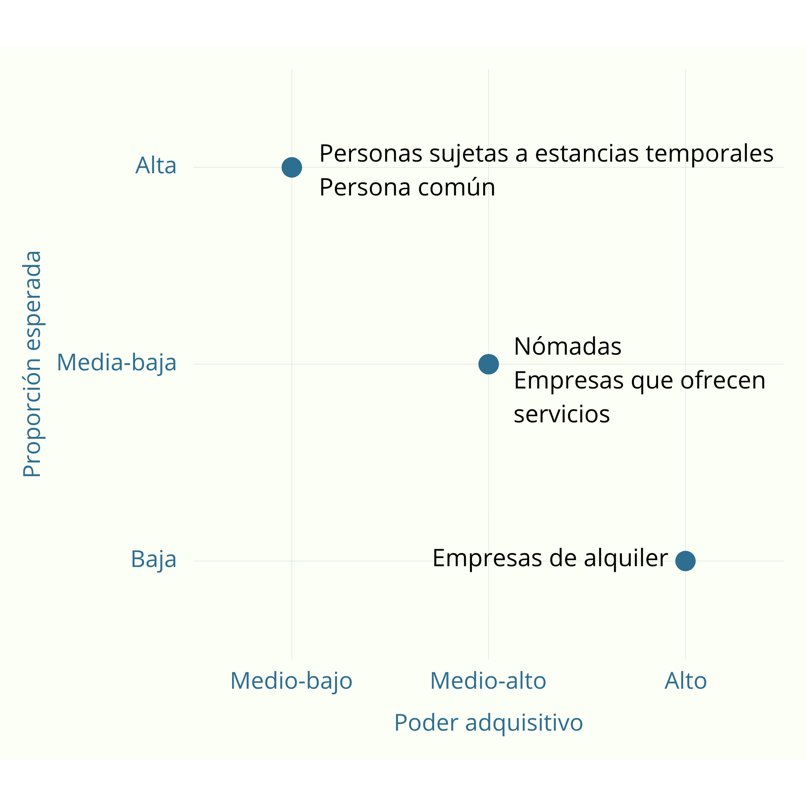

# Análisis de segmentación del mercado

## Índice

1. [Introducción](#1-introducción)
2. [Objetivos](#2-objetivos)
3. [Descripción general del mercado](#3-descripción-general-del-mercado)
4. [Criterios de segmentación](#4-criterios-de-segmentación)
5. [Segmentos](#5-segmentos)  
5.1. [Segmento 1 - Nómadas](#51-segmento-1---nómadas)  
5.2. [Segmento 2 - Personas sujetas a estancias temporales](#52-segmento-2---personas-sujetas-a-estancias-temporales)  
5.3. [Segmento 3 - Persona común](#53-segmento-3---persona-común)  
5.4. [Segmento 4 - Empresas de alquiler](#54-segmento-4---empresas-de-alquiler)  
5.5. [Segmento 5 - Empresas que ofrecen servicios](#55-segmento-5---empresas-que-ofrecen-servicios)
6. [Mapa de posicionamiento](#6-mapa-de-posicionamiento)
7. [Historial de versiones](#7-historial-de-versiones)

## 1. Introducción

Un análisis de segmentación de mercado es el proceso de dividir un mercado amplio en grupos más pequeños de consumidores que comparten características similares, con el objetivo de entenderlos mejor y adaptar productos, servicios o estrategias a cada grupo.

En lugar de tratar a todos los clientes como si fueran iguales, la segmentación permite responder preguntas como: ¿quiénes son mis clientes más importantes?, ¿qué necesitan? y ¿cómo puedo llegar a ellos de forma más eficaz?

## 2. Objetivos

El presente análisis tiene como finalidad definir y orientar la estrategia global de la aplicación a partir de la identificación y comprensión de los distintos segmentos de mercado. A través de este estudio, se busca determinar qué perfiles de usuario presentan mayor interés y potencial, así como entender sus necesidades, comportamientos y expectativas.

Los resultados obtenidos servirán como base para:
- Establecer la estrategia de comunicación, que se concretará en el plan de community management.
- Priorizar el desarrollo de funcionalidades y futuras mejoras de la aplicación.
- Ajustar la propuesta de valor a los distintos segmentos identificados.
- Optimizar la toma de decisiones en aspectos como marketing, precios y experiencia de usuario.

En conjunto, este análisis permitirá alinear el desarrollo del producto y las acciones de marketing con las características reales del mercado objetivo, aumentando así las probabilidades de adopción y éxito de la aplicación.

## 3. Descripción general del mercado

La aplicación se enmarca dentro del ámbito de la economía colaborativa y los modelos de consumo bajo demanda, en los que los usuarios priorizan el acceso temporal a productos y servicios frente a la propiedad. Este tipo de soluciones ha experimentado un crecimiento significativo en los últimos años, impulsado por factores como la digitalización, la movilidad laboral y la búsqueda de mayor flexibilidad en el consumo.

Dado que la aplicación ha sido desarrollada íntegramente en idioma español, su mercado objetivo principal está constituido por usuarios hispanohablantes. Este mercado abarca una amplia diversidad geográfica, incluyendo países de América Latina, Europa y África, y representa un volumen considerable de usuarios potenciales con acceso creciente a tecnologías digitales.

La propuesta de valor de la aplicación —basada en el alquiler de paquetes de objetos y servicios (como suministros)— responde a la necesidad de facilitar soluciones temporales, flexibles y de rápida implementación, reduciendo los costes y la complejidad asociados a la adquisición de bienes o la contratación individual de servicios.

En este contexto, el mercado no solo está compuesto por usuarios que demandan estos productos y servicios, sino también por actores que pueden ofrecerlos. Por ello, el análisis contempla tanto perfiles de demanda (usuarios que necesitan soluciones temporales) como perfiles de oferta (particulares y empresas que buscan rentabilizar sus recursos). Esta doble perspectiva permite entender el funcionamiento de la aplicación como una plataforma que conecta distintos tipos de usuarios con intereses complementarios.

A partir de esta base, en las siguientes secciones se llevará a cabo una segmentación del mercado centrada en el comportamiento de estos perfiles, diferenciando entre usuarios según sus necesidades, motivaciones y forma de interactuar con la plataforma.

## 4. Criterios de segmentación

A partir de la descripción general del mercado, se llevará a cabo una segmentación de tipo conductual, centrada en el comportamiento de los distintos perfiles que interactúan con la plataforma.

Dado que la aplicación funciona como un punto de encuentro entre usuarios que demandan soluciones temporales y actores que ofrecen productos y servicios, la segmentación se realiza considerando ambos roles. De este modo, se identifican segmentos en función de su papel dentro de la plataforma y de la forma en que utilizan el servicio.

En concreto, los segmentos se diferenciarán según sus intereses, necesidades y objetivos, ya que estos factores determinan directamente tanto el uso que hacen de la aplicación como el valor que esperan obtener de ella. Este enfoque permite analizar de manera más precisa la interacción de cada perfil con la plataforma y facilita la definición de estrategias adaptadas a cada tipo de usuario.

## 5. Segmentos

En esta sección se describen los distintos segmentos identificados dentro del mercado objetivo de la aplicación. Para cada uno de ellos, se analizan sus características y necesidades principales, así como su proporción estimada dentro del mercado y su poder adquisitivo.

Adicionalmente, se construye un *buyer persona* para cada segmento, con el objetivo de representarlo de forma más concreta y facilitar la comprensión de sus motivaciones, comportamientos y contexto de uso.

Se han identificado los siguientes segmentos:
- Nómadas.
- Personas sujetas a estancias temporales.
- Persona común.
- Empresas de alquiler.
- Empresas que ofrecen servicios.

## 5.1. Segmento 1 - Nómadas
### 5.1.1. Identificación

| Campo | Descripción |
|-------|-------------|
|**Características** | Personas que cambian frecuentemente de lugar de residencia por estilo de vida (nómadas digitales, viajeros constantes) o por trabajo (consultores, freelancers internacionales, trabajadores remotos). Suelen evitar acumular objetos y prefieren soluciones flexibles y móviles. |
|**Necesidades** | Acceso rápido y flexible a objetos y servicios básicos sin necesidad de comprarlos, facilidad de uso en distintos lugares, reducción de equipaje y costes de mudanza, soluciones adaptadas a estancias cortas o variables. |

### 5.1.2. Análisis detallado
| Campo | Descripción |
|-------|-------------|
|**Proporción esperada**| Media-baja dentro del mercado general, pero en crecimiento debido al aumento del teletrabajo y estilos de vida digitales. |
|**Poder adquisitivo**| Medio a alto. Muchos nómadas digitales tienen ingresos estables o elevados, especialmente en sectores tecnológicos o freelance internacional. |
| **Rentabilidad estimada** | Alta. Aunque el volumen de usuarios no es masivo, el valor por cliente es elevado debido al uso recurrente del servicio, la disposición a pagar por comodidad y la posibilidad de suscripciones o alquiler continuo. |
|**Familiaridad con la tecnología**| Muy alta. Son usuarios digitales avanzados, acostumbrados a apps, plataformas online, pagos digitales y servicios bajo demanda. Baja fricción en adopción del producto. |

### 5.1.3. Buyer persona
| Campo | Descripción |
|-------|-------------|
|**Nombre**| Daniel |
|**Edad**| 29 |
|**Ocupación**| Diseñador UX freelance |
|**Contexto personal**| Trabaja de forma remota mientras viaja entre países cada pocos meses. Vive en alojamientos temporales como Airbnb o colivings. |
|**Objetivos**| Mantener una vida flexible sin depender de posesiones físicas, optimizar movilidad y reducir costes logísticos. |
|**Problemas**| Dificultad para adquirir y transportar objetos básicos en cada destino, falta de soluciones adaptadas a estancias cortas. |
|**Motivaciones**| Libertad, flexibilidad, eficiencia y comodidad durante los viajes. |
|**Comportamiento** | Usa plataformas digitales, compara servicios online y valora suscripciones o modelos bajo demanda. |
|**Canales y comunicación**| Instagram, LinkedIn, comunidades de nómadas digitales, blogs de viajes, apps móviles y plataformas digitales. |

## 5.2. Segmento 2 - Personas sujetas a estancias temporales

### 5.2.1. Identificación

| Campo | Descripción |
|-------|-------------|
|**Características** | Personas que viven temporalmente fuera de su residencia habitual por motivos académicos, laborales o de formación (erasmus, becas, prácticas, proyectos temporales). Su estancia suele durar desde semanas hasta varios meses. |
|**Necesidades** | Acceso económico y temporal a objetos del hogar o trabajo sin necesidad de comprar, facilidad de instalación y devolución, soluciones completas para estancias cortas, flexibilidad en duración del servicio. |

### 5.2.2. Análisis detallado
| Campo | Descripción |
|-------|-------------|
|**Proporción esperada**| Alta en ciudades universitarias y centros laborales internacionales. Segmento estable con picos estacionales (inicio de cursos académicos, programas de intercambio). |
|**Poder adquisitivo**| Medio a bajo (estudiantes) y medio (jóvenes profesionales en prácticas o becas). Sensibles al precio. |
| **Rentabilidad estimada** | Media. El volumen de usuarios es alto, pero el gasto individual es limitado y el uso del servicio suele ser temporal (ciclos de pocos meses). |
|**Familiaridad con la tecnología**| Alta. Están acostumbrados a usar apps móviles, plataformas de alquiler, comparadores y servicios digitales, aunque con menor sofisticación que los nómadas digitales. |

### 5.2.3. Buyer persona
| Campo | Descripción |
|-------|-------------|
|**Nombre**| Laura |
|**Edad**| 21 |
|**Ocupación**| Estudiante de Erasmus |
|**Contexto personal**| Se encuentra de intercambio en otro país durante 6 meses. Vive en un piso compartido amueblado parcialmente o residencia temporal. |
|**Objetivos**| Adaptarse rápidamente a su nueva ciudad sin complicaciones, tener acceso a lo necesario sin gastar demasiado dinero. |
|**Problemas**| No quiere comprar objetos para uso temporal, dificultad para transportar cosas desde su país de origen, presupuesto limitado. |
|**Motivaciones**| Ahorro económico, comodidad, simplicidad y rapidez en la instalación en su nuevo entorno. |
|**Comportamiento** | Busca soluciones económicas online, usa recomendaciones de otros estudiantes, compara precios constantemente. |
|**Canales y comunicación**| TikTok, Instagram, foros de Erasmus, WhatsApp, apps móviles. |

## 5.3. Segmento 3 - Persona común

### 5.3.1. Identificación

| Campo | Descripción |
|-------|-------------|
|**Características** | Particulares que poseen objetos que ya no utilizan muy a menudo, como pueden ser herramientas, electrodomésticos o sábanas, y deciden alquilarlos para generar ingresos extra. |
|**Necesidades** | Plataforma sencilla para publicar sus artículos, seguridad en pagos y transacciones, protección frente a daños o robos, visibilidad para ganar dinero. |

### 5.3.2. Análisis detallado
| Campo | Descripción |
|-------|-------------|
|**Proporción esperada**| Alta, debido al gran número de usuarios potenciales que necesitan dinero y deshacerse de cosas que ya no utilizan.|
|**Poder adquisitivo**| Medio-bajo. Son personas que necesitan ingresos complementarios.|
| **Rentabilidad estimada** |Media. Aunque cada usuario genera poco ingreso individual si son estancias cortas, el gran volumen de usuarios que podrían estar interesados permite obtener ingresos suficientes.|
|**Familiaridad con la tecnología**| Media. Uso habitual de apps, pero pueden necesitar interfaces simples e intuitivas.|

### 5.3.3. Buyer persona
| Campo | Descripción |
|-------|-------------|
|**Nombre**| Javier|
|**Edad**| 35 |
|**Ocupación**| Empleado administrativo.|
|**Contexto personal**| Tiene en su casa artículos que prácticamente no usa. |
|**Objetivos**| Obtener ingresos extra a partir de bienes que ya posee. |
|**Problemas**| Miedo a impagos o daños de sus objetos. |
|**Motivaciones**| Rentabilizar sus pertenencias sin mucho esfuerzo. |
|**Comportamiento** | Publica objetos de forma ocasional, busca obtener ingresos extra sin dedicar demasiado tiempo. |
|**Canales y comunicación**|  Apps móviles, Facebook Marketplace, Wallapop, Google.|

## 5.4. Segmento 4 - Empresas de alquiler

### 5.4.1. Identificación

| Campo | Descripción |
|-------|-------------|
|**Características** | Empresas que operan en el sector del alquiler (herramientas, mobiliario, equipos, etc.) y buscan ampliar su alcance o digitalizar sus servicios. |
|**Necesidades** | Mayor visibilidad, digitalizar su negocio, gestionar de forma eficiente su inventario y aprovechar canales online para incrementar ingresos. |

### 5.4.2. Análisis detallado
| Campo | Descripción |
|-------|-------------|
|**Proporción esperada**| Baja. El número de empresas es limitado en comparación con usuarios particulares. |
|**Poder adquisitivo**| Alto. Son negocios con capacidad de inversión y orientadas a generar ingresos.|
| **Rentabilidad estimada** |Muy alta. Estas empresas pueden incorporar un gran volumen de productos, lo que genera numerosas transacciones dentro de la plataforma. Cada alquiler produce comisiones, por lo que el ingreso acumulado es elevado. |
|**Familiaridad con la tecnología**|Media-alta. Hay varias empresas que aún están en proceso de digitalización.|

### 5.4.3. Buyer persona
| Campo | Descripción |
|-------|-------------|
|**Nombre**| Carlos|
|**Edad**| 47 |
|**Ocupación**| Propietario de una empresa de alquiler |
|**Contexto personal**| Gestiona un negocio con múltiples artículos disponibles para alquiler. Busca nuevas formas de aumentar la ocupación de sus productos y crecer en el entorno digital. |
|**Objetivos**| Incrementar ingresos, mejorar la visibilidad de su negocio y maximizar el uso de sus activos.|
|**Problemas**| Dependencia de canales tradicionales, dificultad para captar nuevos clientes online y periodos de inactividad de sus productos. |
|**Motivaciones**| Crecimiento del negocio, optimización de recursos y aumento de la rentabilidad. |
|**Comportamiento** | Utiliza la plataforma de forma intensiva, publicando gran parte de su catálogo, buscando maximizar reservas. Está dispuesto a pagar por visibilidad si esto aumenta sus ingresos. |
|**Canales y comunicación**| LinkedIn, email profesional, ferias del sector, networking. |

## 5.5. Segmento 5 - Empresas que ofrecen servicios

### 5.5.1. Identificación

| Campo | Descripción |
|-------|-------------|
|**Características** | Empresas que ofrecen servicios como, por ejemplo, transporte, Internet, luz, agua, líneas telefónicas, etc. |
|**Necesidades** | Acceso a una base de clientes activa, generación constante de demanda, visibilidad dentro de la plataforma, facilidad para gestionar solicitudes de servicio y optimización del tiempo de trabajo. |

### 5.5.2. Análisis detallado
| Campo | Descripción |
|-------|-------------|
|**Proporción esperada**| Media-baja. Existe un número relevante de empresas, aunque menor que el de usuarios particulares. |
|**Poder adquisitivo**| Medio-alto. Varía según el tamaño del negocio. |
| **Rentabilidad estimada** |Alta. Generación de ingresos por comisiones o servicios asociados.|
|**Familiaridad con la tecnología**|Media. Este tipo de empresas acostumbran a estar digitalizadas, aunque también existen otras muchas que no lo están.|

### 5.5.3. Buyer persona
| Campo | Descripción |
|-------|-------------|
|**Nombre**| Ana |
|**Edad**| 26 |
|**Ocupación**| Gerente de una empresa de instalación de Internet.|
|**Contexto personal**| Gestiona una empresa que ofrece servicios de instalación de Internet en hogares y negocios. Su actividad consiste en coordinar equipos técnicos, organizar instalaciones y asegurar la correcta prestación del servicio en distintas ubicaciones. |
|**Objetivos**|  Optimizar la captación de clientes para servicios de instalación de Internet, aumentar el volumen de instalaciones realizadas y mejorar la eficiencia en la asignación de técnicos y recursos. |
|**Problemas**|  Dependencia de intermediarios o grandes contratos con operadoras, dificultad para captar clientes de forma directa y necesidad de mejorar la visibilidad del negocio en canales digitales.|
|**Motivaciones**|Crecimiento de la empresa, incremento de ingresos y expansión del negocio en entornos digitales. |
|**Comportamiento** | Utiliza la plataforma como canal para captar nuevos clientes de instalación.|
|**Canales y comunicación**| WhatsApp, Google, plataformas profesionales, redes sociales y herramientas de gestión empresarial. |

## 6. Mapa de posicionamiento

A continuación se presenta el mapa de posicionamiento de los segmentos identificados. Este gráfico permite visualizar de forma comparativa la relación entre el poder adquisitivo y la proporción estimada de cada segmento dentro del mercado objetivo.

Su objetivo es facilitar la interpretación del atractivo relativo de cada grupo para la aplicación, así como apoyar la toma de decisiones estratégicas.

## 7. Historial de versiones

| Versión | Fecha       | Descripción                   | Autor(es)       |
|---------|------------|--------------------------------|------------|
| 1.0.0   |29/04/2026 | Versión inicial con dos segmentos analizados|Lucía Ponce García de Sola |
| 1.1.0   |29/04/2026 | Versión en la que se añaden otros tres segmentos|Enrique Nicolae Barac Ploae|