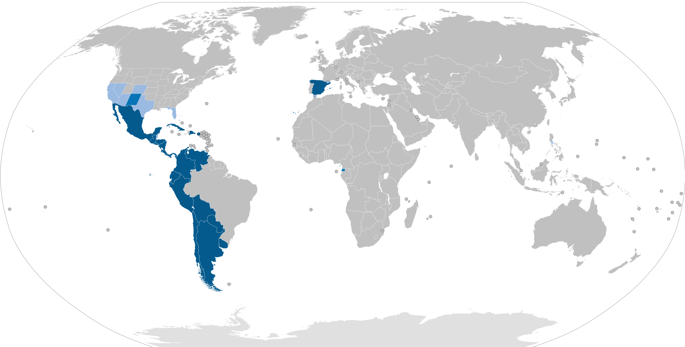

# Análisis de segmentación del mercado

## Índice

1. [Introducción](#1-introducción)
2. [Objetivos](#2-objetivos)
3. [Descripción general del mercado](#3-descripción-general-del-mercado)
4. [Criterios de segmentación](#4-criterios-de-segmentación)
5. [Segmentos](#5-segmentos)  
5.1. [Segmento 1 - Nómadas](#51-segmento-1---nómadas)  
5.2. [Segmento 2 - Personas sujetas a estancias temporales](#52-segmento-2---personas-sujetas-a-estancias-temporales)  
5.3. [Segmento 3 - Persona común](#53-segmento-3---persona-común)  
5.4. [Segmento 4 - Empresas de alquiler](#54-segmento-4---empresas-de-alquiler)  
5.5. [Segmento 5 - Empresas que ofrecen servicios](#55-segmento-5---empresas-que-ofrecen-servicios)
6. [Mapa de posicionamiento](#6-mapa-de-posicionamiento)
7. [Historial de versiones](#7-historial-de-versiones)

## 1. Introducción

Un análisis de segmentación de mercado es el proceso de dividir un mercado amplio en grupos más pequeños de consumidores que comparten características similares, con el objetivo de entenderlos mejor y adaptar productos, servicios o estrategias a cada grupo.

En lugar de tratar a todos los clientes como si fueran iguales, la segmentación permite responder preguntas como: ¿quiénes son mis clientes más importantes?, ¿qué necesitan? y ¿cómo puedo llegar a ellos de forma más eficaz?

## 2. Objetivos

El presente análisis tiene como finalidad definir y orientar la estrategia global de la aplicación a partir de la identificación y comprensión de los distintos segmentos de mercado. A través de este estudio, se busca determinar qué perfiles de usuario presentan mayor interés y potencial, así como entender sus necesidades, comportamientos y expectativas.

Los resultados obtenidos servirán como base para:
- Establecer la estrategia de comunicación, que se concretará en el plan de community management.
- Priorizar el desarrollo de funcionalidades y futuras mejoras de la aplicación.
- Ajustar la propuesta de valor a los distintos segmentos identificados.
- Optimizar la toma de decisiones en aspectos como marketing, precios y experiencia de usuario.

En conjunto, este análisis permitirá alinear el desarrollo del producto y las acciones de marketing con las características reales del mercado objetivo, aumentando así las probabilidades de adopción y éxito de la aplicación.

## 3. Descripción general del mercado

Dado que la aplicación ha sido desarrollada en idioma español, su mercado objetivo principal está constituido por usuarios hispanohablantes. Este enfoque permite dirigirse a una comunidad lingüística amplia, con características culturales y de consumo relativamente homogéneas, lo que facilita la adaptación del producto y la estrategia de comunicación.

El español es una de las lenguas más habladas del mundo, con más de 600 millones de hablantes en distintos niveles de competencia, lo que lo convierte en un mercado de gran relevancia a nivel global. Además, la mayoría de estos hablantes se concentra en América Latina, donde reside aproximadamente el 90 % de la población hispanohablante.

En este contexto, la aplicación se orienta principalmente a usuarios de países donde el español es lengua oficial, entre los que destacan: México, Colombia, España, Argentina, Perú, Venezuela y Chile.

Este mercado presenta un alto potencial debido a su tamaño, crecimiento y progresiva digitalización. La expansión del acceso a internet y el uso de aplicaciones móviles en estos países favorecen la adopción de plataformas digitales, especialmente aquellas basadas en modelos de economía colaborativa y consumo bajo demanda.

No obstante, el idioma constituye únicamente un criterio de delimitación inicial del mercado. Para un análisis más preciso y orientado a la toma de decisiones, resulta necesario profundizar en el comportamiento de los usuarios. 

## 4. Criterios de segmentación

En este análisis, se llevará a cabo una segmentación de mercado de tipo conductual, basada en el comportamiento de los usuarios y en el uso potencial del servicio.

En concreto, los segmentos se diferenciarán en función de sus intereses, necesidades y objetivos, ya que estos factores determinan de manera directa la forma en que los usuarios interactúan con la aplicación y el valor que esperan obtener de ella.

## 5. Segmentos

En esta sección se describen los distintos segmentos identificados dentro del mercado objetivo de la aplicación. Para cada uno de ellos, se analizan sus características y necesidades principales, así como su proporción estimada dentro del mercado y su poder adquisitivo.

Adicionalmente, se construye un *buyer persona* para cada segmento, con el objetivo de representarlo de forma más concreta y facilitar la comprensión de sus motivaciones, comportamientos y contexto de uso.

Se han identificado los siguientes segmentos:
- Nómadas.
- Personas sujetas a estancias temporales.
- Persona común.
- Empresas de alquiler.
- Empresas que ofrecen servicios.

## 5.1. Segmento 1 - Nómadas
### 5.1.1. Identificación

| Campo | Descripción |
|-------|-------------|
|**Características** | Personas que cambian frecuentemente de lugar de residencia por estilo de vida (nómadas digitales, viajeros constantes) o por trabajo (consultores, freelancers internacionales, trabajadores remotos). Suelen evitar acumular objetos y prefieren soluciones flexibles y móviles. |
|**Necesidades** | Acceso rápido y flexible a objetos y servicios básicos sin necesidad de comprarlos, facilidad de uso en distintos lugares, reducción de equipaje y costes de mudanza, soluciones adaptadas a estancias cortas o variables. |

### 5.1.2. Análisis detallado
| Campo | Descripción |
|-------|-------------|
|**Proporción esperada**| Media-baja dentro del mercado general, pero en crecimiento debido al aumento del teletrabajo y estilos de vida digitales. |
|**Poder adquisitivo**| Medio a alto. Muchos nómadas digitales tienen ingresos estables o elevados, especialmente en sectores tecnológicos o freelance internacional. |
| **Rentabilidad estimada** | Alta. Aunque el volumen de usuarios no es masivo, el valor por cliente es elevado debido al uso recurrente del servicio, la disposición a pagar por comodidad y la posibilidad de suscripciones o alquiler continuo. |
|**Familiaridad con la tecnología**| Muy alta. Son usuarios digitales avanzados, acostumbrados a apps, plataformas online, pagos digitales y servicios bajo demanda. Baja fricción en adopción del producto. |

### 5.1.3. Buyer persona
| Campo | Descripción |
|-------|-------------|
|**Nombre**| Daniel, el nómada digital |
|**Edad**| 29 |
|**Ocupación**| Diseñador UX freelance |
|**Contexto personal**| Trabaja de forma remota mientras viaja entre países cada pocos meses. Vive en alojamientos temporales como Airbnb o colivings. |
|**Objetivos**| Mantener una vida flexible sin depender de posesiones físicas, optimizar movilidad y reducir costes logísticos. |
|**Problemas**| Dificultad para adquirir y transportar objetos básicos en cada destino, falta de soluciones adaptadas a estancias cortas. |
|**Motivaciones**| Libertad, flexibilidad, eficiencia y comodidad durante los viajes. |
|**Comportamiento** | Usa plataformas digitales, compara servicios online y valora suscripciones o modelos bajo demanda. |
|**Canales y comunicación**| Instagram, LinkedIn, comunidades de nómadas digitales, blogs de viajes, apps móviles y plataformas digitales. |

## 5.2. Segmento 2 - Personas sujetas a estancias temporales

### 5.2.1. Identificación

| Campo | Descripción |
|-------|-------------|
|**Características** | Personas que viven temporalmente fuera de su residencia habitual por motivos académicos, laborales o de formación (erasmus, becas, prácticas, proyectos temporales). Su estancia suele durar desde semanas hasta varios meses. |
|**Necesidades** | Acceso económico y temporal a objetos del hogar o trabajo sin necesidad de comprar, facilidad de instalación y devolución, soluciones completas para estancias cortas, flexibilidad en duración del servicio. |

### 5.2.2. Análisis detallado
| Campo | Descripción |
|-------|-------------|
|**Proporción esperada**| Alta en ciudades universitarias y centros laborales internacionales. Segmento estable con picos estacionales (inicio de cursos académicos, programas de intercambio). |
|**Poder adquisitivo**| Medio a bajo (estudiantes) y medio (jóvenes profesionales en prácticas o becas). Sensibles al precio. |
| **Rentabilidad estimada** | Media. El volumen de usuarios es alto, pero el gasto individual es limitado y el uso del servicio suele ser temporal (ciclos de pocos meses). |
|**Familiaridad con la tecnología**| Alta. Están acostumbrados a usar apps móviles, plataformas de alquiler, comparadores y servicios digitales, aunque con menor sofisticación que los nómadas digitales. |

### 5.2.3. Buyer persona
| Campo | Descripción |
|-------|-------------|
|**Nombre**| Laura, la estudiante Erasmus |
|**Edad**| 21 |
|**Ocupación**| Estudiante universitaria |
|**Contexto personal**| Se encuentra de intercambio en otro país durante 6 meses. Vive en un piso compartido amueblado parcialmente o residencia temporal. |
|**Objetivos**| Adaptarse rápidamente a su nueva ciudad sin complicaciones, tener acceso a lo necesario sin gastar demasiado dinero. |
|**Problemas**| No quiere comprar objetos para uso temporal, dificultad para transportar cosas desde su país de origen, presupuesto limitado. |
|**Motivaciones**| Ahorro económico, comodidad, simplicidad y rapidez en la instalación en su nuevo entorno. |
|**Comportamiento** | Busca soluciones económicas online, usa recomendaciones de otros estudiantes, compara precios constantemente. |
|**Canales y comunicación**| TikTok, Instagram, foros de Erasmus, WhatsApp, apps móviles. |

## 5.3. Segmento 3 - Persona común

### 5.3.1. Identificación

| Campo | Descripción |
|-------|-------------|
|**Características** |  |
|**Necesidades** |  |

### 5.3.2. Análisis detallado
| Campo | Descripción |
|-------|-------------|
|**Proporción esperada**|  |
|**Poder adquisitivo**|  |
| **Rentabilidad estimada** ||
|**Familiaridad con la tecnología**||

### 5.3.3. Buyer persona
| Campo | Descripción |
|-------|-------------|
|**Nombre**|  |
|**Edad**|  |
|**Ocupación**| |
|**Contexto personal**|  |
|**Objetivos**|  |
|**Problemas**|  |
|**Motivaciones**|  |
|**Comportamiento** |  |
|**Canales y comunicación**|  |

## 5.4. Segmento 4 - Empresas de alquiler

### 5.4.1. Identificación

| Campo | Descripción |
|-------|-------------|
|**Características** |  |
|**Necesidades** |  |

### 5.4.2. Análisis detallado
| Campo | Descripción |
|-------|-------------|
|**Proporción esperada**|  |
|**Poder adquisitivo**|  |
| **Rentabilidad estimada** ||
|**Familiaridad con la tecnología**||

### 5.4.3. Buyer persona
| Campo | Descripción |
|-------|-------------|
|**Nombre**|  |
|**Edad**|  |
|**Ocupación**| |
|**Contexto personal**|  |
|**Objetivos**|  |
|**Problemas**|  |
|**Motivaciones**|  |
|**Comportamiento** |  |
|**Canales y comunicación**|  |

## 5.5. Segmento 5 - Empresas que ofrecen servicios

### 5.5.1. Identificación

| Campo | Descripción |
|-------|-------------|
|**Características** |  |
|**Necesidades** |  |

### 5.5.2. Análisis detallado
| Campo | Descripción |
|-------|-------------|
|**Proporción esperada**|  |
|**Poder adquisitivo**|  |
| **Rentabilidad estimada** ||
|**Familiaridad con la tecnología**||

### 5.5.3. Buyer persona
| Campo | Descripción |
|-------|-------------|
|**Nombre**|  |
|**Edad**|  |
|**Ocupación**| |
|**Contexto personal**|  |
|**Objetivos**|  |
|**Problemas**|  |
|**Motivaciones**|  |
|**Comportamiento** |  |
|**Canales y comunicación**|  |

## 6. Mapa de posicionamiento

A continuación se presenta el mapa de posicionamiento de los segmentos identificados. Este gráfico permite visualizar de forma comparativa la relación entre el poder adquisitivo y la proporción estimada de cada segmento dentro del mercado objetivo.

Su objetivo es facilitar la interpretación del atractivo relativo de cada grupo para la aplicación, así como apoyar la toma de decisiones estratégicas.

| Proporción esperada | Poder adquisitivo||||
|----:|:---:|:---:|:---:|:---:|
| |**Bajo** | **Medio-bajo** | **Medio-alto**| **Alto** |
|**Alta** ||Personas sujetas a estancias temporales|||
|**Media-alta** |
|**Media-baja**|||Nómadas||
|**Baja** | 

## 7. Historial de versiones

| Versión | Fecha       | Descripción                   | Autor(es)       |
|---------|------------|--------------------------------|------------|
| 1.0.0   |29/04/2026 | Versión inicial con dos segmentos analizados|Lucía Ponce García de Sola |