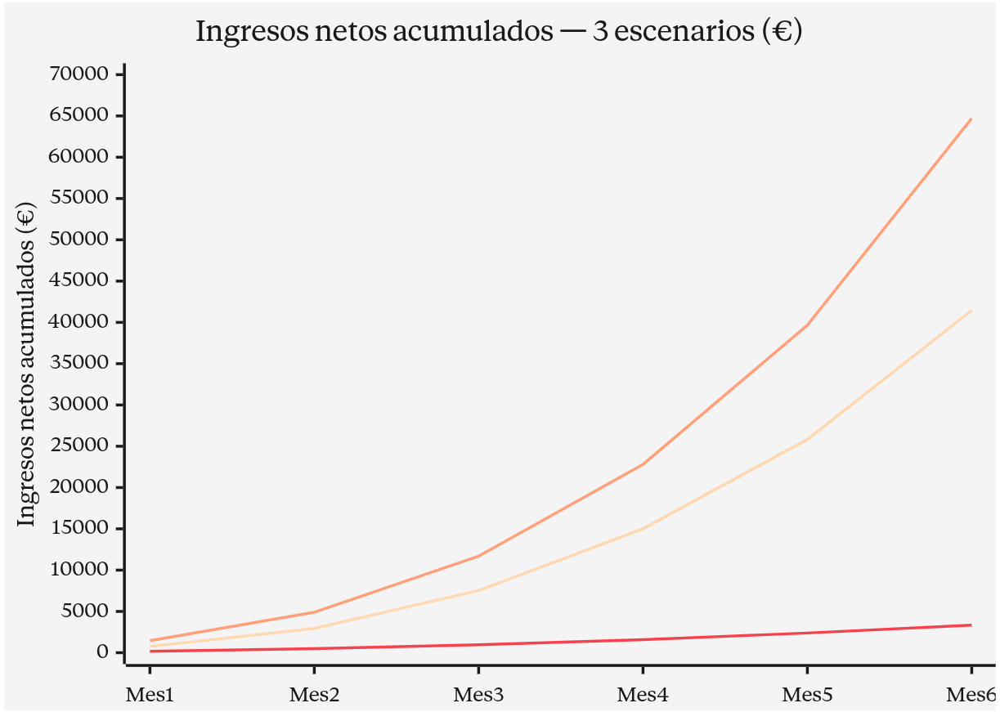
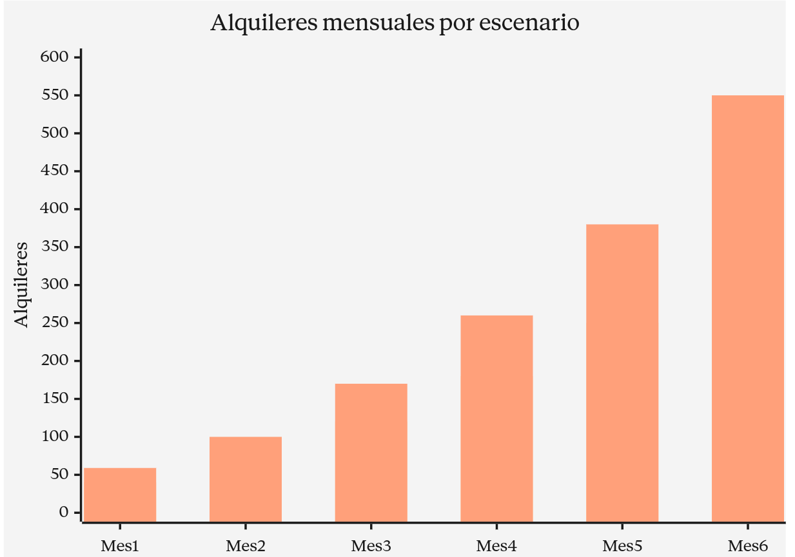

# Estimación de Rentabilidad, Gestión de Costes y Plan de Beneficiación de Usuarios Piloto --- Proyecto KeaKit

## Índice

1. [Resumen ejecutivo](#1-resumen-ejecutivo)
2. [Modelo de negocio](#2-modelo-de-negocio)
   - 2.1 [Propuesta de valor](#21-propuesta-de-valor)
   - 2.2 [Modelo de ingresos](#22-modelo-de-ingresos)
   - 2.3 [Anuncio para inversores](#23-anuncio-para-inversores)
3. [Gestión de costes (CAPEX y OPEX)](#3-gestión-de-costes-capex-y-opex)
   - 3.1 [Coste por hora de cada rol](#31-coste-por-hora-de-cada-rol)
   - 3.2 [Horas totales del proyecto y distribución por rol](#32-horas-totales-del-proyecto-y-distribución-por-rol)
   - 3.3 [Coste de recursos humanos](#33-coste-de-recursos-humanos)
   - 3.4 [Recursos no humanos: amortización de equipos](#34-recursos-no-humanos-amortización-de-equipos)
   - 3.5 [Costes operativos durante el desarrollo](#35-costes-operativos-durante-el-desarrollo)
   - 3.6 [Costes operativos recurrentes (post-lanzamiento)](#36-costes-operativos-recurrentes-post-lanzamiento)
4. [Costes de marketing](#4-costes-de-marketing)
   - 4.1 [Rol de Community Manager](#41-rol-de-community-manager)
   - 4.2 [Inversión publicitaria en redes sociales](#42-inversión-publicitaria-en-redes-sociales)
   - 4.3 [Coste total de marketing](#43-coste-total-de-marketing)
5. [Plan de beneficiación de usuarios piloto](#5-plan-de-beneficiación-de-usuarios-piloto)
   - 5.1 [Composición real del programa piloto](#51-composición-real-del-programa-piloto)
   - 5.2 [Sistema de incentivos](#52-sistema-de-incentivos)
   - 5.3 [Coste real del programa y excedente](#53-coste-real-del-programa-y-excedente)
   - 5.4 [Reinversión del excedente: sorteo de códigos promocionales](#54-reinversión-del-excedente-sorteo-de-códigos-promocionales)
6. [Presupuesto total del proyecto](#6-presupuesto-total-del-proyecto)
7. [Estimación de rentabilidad: tres escenarios](#7-estimación-de-rentabilidad-tres-escenarios)
   - 7.1 [Hipótesis base de los escenarios](#71-hipótesis-base-de-los-escenarios)
   - 7.2 [Escenario pesimista](#72-escenario-pesimista)
   - 7.3 [Escenario realista (referencia)](#73-escenario-realista-referencia)
   - 7.4 [Escenario optimista](#74-escenario-optimista)
   - 7.5 [Comparativa visual de los tres escenarios](#75-comparativa-visual-de-los-tres-escenarios)
8. [Punto de equilibrio y mínimo de usuarios](#8-punto-de-equilibrio-y-mínimo-de-usuarios)
9. [Validación con datos reales: estimación vs realidad](#9-validación-con-datos-reales-estimación-vs-realidad)
10. [Conclusión económica](#10-conclusión-económica)
11. [Fuentes y referencias](#11-fuentes-y-referencias)

---

## 1. Resumen ejecutivo

| Indicador | Valor |
|---|---|
| Coste total del proyecto (desarrollo + lanzamiento) | **72.933,00 €** |
| Coste operativo recurrente mensual (post-lanzamiento) | **1.169,00 €** |
| Comisión por alquiler (20 %) | **48 €** |
| Inversión en programa piloto (techo) | **1.584 €** |
| Punto de equilibrio (alquileres acumulados) | **≈ 1.520 alquileres** |
| Punto de equilibrio temporal estimado (escenario realista) | **Mes 9–10 tras lanzamiento** |
| Mínimo de alquileres mensuales para cubrir OPEX | **≈ 25 alquileres/mes** |
| Mínimo de usuarios activos para cubrir OPEX | **≈ 20 usuarios/mes** |

> El proyecto presenta un modelo escalable de bajo coste fijo, con punto de equilibrio alcanzable en menos de un año bajo el escenario realista, y capacidad de generar beneficio neto recurrente a partir del mes 10 post-lanzamiento.

---

## 2. Modelo de negocio

### 2.1 Propuesta de valor

KeaKit es una plataforma de **alquiler entre particulares de kits y productos** (modelo C2C / *peer-to-peer rental*) que conecta a:

- **Arrendadores**, que publican objetos infrautilizados para obtener una renta extra.
- **Arrendatarios**, que acceden a productos por una fracción del precio de compra durante el tiempo que los necesitan.

La plataforma se posiciona como intermediaria, aportando confianza (verificación de usuarios, sistema de valoraciones, gestión integral del pago vía Stripe Connect), logística digital (geolocalización, gestión de incidencias) y promociones (kits predeterminados temáticos).

### 2.2 Modelo de ingresos

El modelo se basa en una **comisión del 20 % sobre cada kit alquilado** dentro de la plataforma. El precio medio por kit se ha estimado en **240 €**, tomando como referencia productos comparables del mercado como el *Kit Quick Muv*.

Cálculo del ingreso por transacción:

```
240 € x 0,20 = 48 € de comisión por cada kit alquilado
```

Este es el ingreso unitario que sustenta toda la proyección financiera del proyecto.

### 2.3 Anuncio para inversores

> **KeaKit busca una ronda *seed* de 90.000 € para acelerar el crecimiento y alcanzar break-even en menos de 12 meses.**

**Tracción actual:**
- 33 usuarios piloto reales captados en tres oleadas (18 arrendadores + 15 arrendatarios).
- MVP funcional desplegado y validado durante 3 sprints.
- Modelo de negocio validado con datos reales de captación (crecimiento del 11,76 % entre Sprint 2 y actualidad).

**Uso de los fondos:**

| Partida | Importe | % |
|---|---:|---:|
| Refuerzo de marketing y captación (Ads + Community Manager) | 30.000 € | 33 % |
| Costes operativos recurrentes (12 meses) | 14.028 € | 16 % |
| Mejoras producto y nuevas funcionalidades | 25.000 € | 28 % |
| Reserva de contingencia y campañas estacionales | 20.972 € | 23 % |
| **Total** | **90.000 €** | **100 %** |

**Hitos esperados con la ronda:**
- Mes 6: 350 alquileres mensuales (ingreso bruto 16.800 €/mes).
- Mes 9–10: punto de equilibrio operativo.
- Mes 12: 600 alquileres mensuales (ingreso bruto 28.800 €/mes), inicio de retorno al inversor.

**Retorno proyectado (escenario realista):** recuperación íntegra de la inversión en 14–16 meses. A partir de ahí, los ingresos netos pasan a beneficio reinvertible.

---

## 3. Gestión de costes (CAPEX y OPEX)

### 3.1 Coste por hora de cada rol

Para estimar el coste total del proyecto se ha calculado el coste por hora de cada uno de los roles implicados. Los salarios base se han obtenido a partir de **salarios medios del sector tecnológico en España publicados en portales especializados** (Glassdoor, Indeed, Jobted), y posteriormente se ha aplicado un incremento del **30 % correspondiente a las cotizaciones empresariales a la Seguridad Social**(valor aproximado para simplificar entre contingencias comunes, desempleo, FOGASA, formación profesional...), con el objetivo de reflejar el coste real que asumiría una empresa por cada trabajador.

| Rol | Salario base (€/h) | Coste empresa +30 % (€/h) | Fuente |
|---|---:|---:|---|
| Ingeniero de testing | 15,00 | 19,50 | Glassdoor --- *QA Engineer Junior España 2026* |
| Programador junior | 14,10 | 18,33 | Glassdoor --- *Junior Developer España 2026* |
| Jefe de proyecto | 28,00 | 36,40 | Glassdoor --- *Project Manager IT España 2026* |
| Jefe de equipo | 28,00 | 36,40 | Glassdoor --- *Team Lead España 2026* |
| Marketing junior | 11,00 | 14,30 | Glassdoor --- *Marketing Junior España 2026* |
| Community Manager | 12,00 | 15,60 | Glassdoor --- Community Manager España 2026 |
| Ingeniero DevOps junior | 18,23 | 23,70 | Glassdoor --- *DevOps Junior España 2026* |
| GDPR Officer | 29,07 | 37,80 | Convenios sectoriales --- *Data Protection Officer España 2026* |


### 3.2 Horas totales del proyecto y distribución por rol

El equipo de desarrollo está compuesto por **21 integrantes**, dedicando cada uno **150 horas** al proyecto (≈ 6 ECTS):

```
21 integrantes x 150 horas = 3.150 horas totales
```

**Distribución entre tareas técnicas (2.520 h):**

| Rol | Horas |
|---|---:|
| Programación | 1.512 h |
| Testing | 1.008 h |

**Distribución entre roles de apoyo (630 h):**

| Rol | Personas | Horas/persona | Total |
|---|---:|---:|---:|
| Jefes de proyecto | 2 | 80 h | 160 h |
| Jefes de equipo | 5 | 60 h | 300 h |
| DevOps | 1 | 100 h | 100 h |
| Marketing | 2 | 35 h | 70 h |
| GDPR Officer | 1 | 20 h | 20 h |
| Community Manager | 1 | 30 h | 30 h |


### 3.3 Coste de recursos humanos

| Rol | Cálculo | Coste |
|---|---|---:|
| Programación | 1.512 h x 18,33 €/h | 27.715 € |
| Testing | 1.008 h x 19,50 €/h | 19.656 € |
| Jefes de proyecto | 160 h x 36,40 €/h | 5.824 € |
| Jefes de equipo | 300 h x 36,40 €/h | 10.920 € |
| DevOps | 100 h x 23,70 €/h | 2.370 € |
| Marketing | 70 h x 14,30 €/h | 1.001 € |
| Community Manager | 30 h x 15,60 €/h | 468 € |
| GDPR Officer | 20 h x 37,80 €/h | 756 € |
| **Total recursos humanos** | | **68.710 €** |

### 3.4 Recursos no humanos: amortización de equipos

Para estimar este valor imputaremos al proyecto únicamente la **cuota de amortización proporcional** del valor íntegro del inmovilizado material al tiempo real de uso del equipo en este proyecto.

#### Marco legal y método

Según las [tablas oficiales de amortización de la Agencia Tributaria](https://www.supercontable.com/informacion/impuesto_sociedades/Amortizacion_de_inmovilizado.Equipos_para_procesos_de_.html) (Ley 27/2014 del Impuesto sobre Sociedades), los equipos se amortizan con:

- **Coeficiente lineal máximo: 25 % anual.**
- **Periodo máximo: 8 años.**

En la práctica empresarial, lo más habitual es aplicar el coeficiente máximo del **25 % anual (vida útil de 4 años)** debido a la rápida obsolescencia tecnológica de los portátiles.

#### Cálculo aplicado a nuestros equipos

- **21 portátiles x 900 €** (precio medio de mercado para un portátil de gama media, suficiente para desarrollo web) = **18.900 €** de inversión.
- **Cuota anual de amortización lineal (25 %):** 18.900 € x 0,25 = **4.725 €/año**.
- **Cuota mensual:** 4.725 € / 12 = **393,75 €/mes**.
- **Duración del proyecto imputable:** 4 meses de desarrollo activo.
- **Amortización imputable al proyecto:** 393,75 € x 4 meses = **1.575 €**.

| Concepto | Valor total |
|---|---:|
| Imputación al proyecto del coste de portátiles | **1.575 €** |


### 3.5 Costes operativos durante el desarrollo

#### Plan elegido en DigitalOcean

Tras analizar los planes disponibles en la página oficial de [DigitalOcean Droplets Pricing](https://www.digitalocean.com/pricing/droplets), se ha optado por el plan **Premium Intel 2 vCPU / 4 GiB RAM / 80 GB SSD**, con un coste de **24 USD/mes** (**aproximadamente 22 €/mes**). Este plan se considera el mínimo viable para una aplicación en producción con tráfico moderado y permite escalar a planes superiores sin migración.

#### Licencias software

| Concepto | Cálculo | Coste |
|---|---|---:|
| Licencias de herramientas de desarrollo (equipo completo) | 21 x 24 € | 504,00 € |
| DigitalOcean Droplet (4 meses de desarrollo) | 22 € x 4 | 88,00 € |
| Dominio + correo profesional (4 meses) | 12 €/año x 4/12 | 4,00 € |
| **Total licencias y servicios desarrollo** | | **596,00 €** |

### 3.6 Costes operativos recurrentes (post-lanzamiento)

Una vez desplegada la aplicación, se mantienen los siguientes costes mensuales:

| Concepto | Coste mensual | Coste anual | Fuente |
|---|---:|---:|---|
| DigitalOcean Droplet (Premium 2vCPU/4GB) | 22,00 € | 264,00 € | [digitalocean.com/pricing/droplets](https://www.digitalocean.com/pricing/droplets) |
| Dominio + correo profesional | 1,00 € | 12,00 € | Registradores estándar |
| GDPR Officer (10 h/mes) | 378,00 € | 4.536,00 € | 10 h x 37,80 €/h |
| Community Manager (30 h/mes) | 468,00 € | 5.616,00 € | 30 h x 15,60 €/h |
| Inversión en publicidad | 300,00 € | 3.600,00 € | Presupuesto medio recomendado PYME |
| **OPEX mensual total** | **1.169,00 €** | **14.028,00 €** | |

---

## 4. Costes de marketing

### 4.1 Rol de Community Manager

#### Justificación del rol

Una plataforma C2C necesita visibilidad constante en redes sociales (Instagram, TikTok, LinkedIn) y gestión activa de la comunidad: respuesta a comentarios, generación de contenido orgánico, atención a usuarios potenciales y gestión de crisis de reputación.

#### Salario de referencia

Tomando como base los datos publicados en portales de empleo especializados en España actualizados a 2026 en lugares como [**Glassdoor**](https://www.glassdoor.es/Sueldos/community-manager-sueldo-SRCH_KO0,17.htm) en el cual se afirma un salario medio de 25.250 €/año (sobre 12 €/h base) para un Community Manager. Para perfiles junior, la horquilla baja típica es de 20.750 €/año (10 €/h).

Por lo tanto, se ha optado por un **perfil junior** con un coste-hora base de **12 €/h**, alineado con la mediana de Glassdoor para entrada al mercado. Aplicando el +30 % de cotizaciones empresariales:

```
12 €/h x 1,30 = 15,60 €/h coste-empresa
```

#### Dedicación y coste (30 horas/mes (aprox. 7-8 h/semana))

| Fase | Cálculo | Coste |
|---|---:|---|
| Pre-lanzamiento (4 meses de desarrollo) | 30 h x 15,60 €/h | 468,00 € |
| Post-lanzamiento (recurrente) | 30 h x 15,60 €/h | 468,00 €/mes |


### 4.2 Inversión publicitaria en redes sociales

#### Plataformas elegidas y justificación

KeaKit se dirige a un público joven-adulto (25-45 años) familiarizado con la economía colaborativa. Las plataformas más eficientes según los benchmarks 2026 son:

- **Meta Ads (Facebook + Instagram):** mayor alcance y mejor segmentación demográfica.
- **TikTok Ads:** público más joven, formato vídeo nativo de bajo coste.

#### Tarifas de referencia

A partir de los benchmarks publicados para España en 2026 las tarifas por CPC (Coste Por Clic en anuncio) y CPM (Coste Por Mil visualizaciones) suelen ser:

- [**Effinity / Facebook Ads España 2026**](https://www.effinity.fr/es/blog/coste-de-la-publicidad-en-facebook-2026-tarifas-presupuestos-y-estrategias-de-optimizacion/): CPC medio entre **0,30 € y 0,70 €**. Por lo que su presupuesto recomendado será de **200–500 €/mes** para alimentar correctamente al algoritmo.
- [**NeoAttack --- Facebook Ads España 2026**](https://neoattack.com/blog/cuanto-cuesta-facebook-ads/): en España el **CPM ronda entre 2 € y 5 €**, y el **CPC entre 0,50 € y 3 €**.
- [**Destakamarketing --- Instagram Ads 2026**](https://destakamarketing.com/blog/cuanto-cuesta-instagram-ads-precios/): CPC promedio en Instagram **0,85–0,95 €**, CPM medio **7,28 €**.
- [**Propulsia --- Instagram Ads España 2026**](https://propulsia.es/precios-publicidad-instagram/): CPM en España oscila entre **5 € y 12 €** según estacionalidad.

#### Estimación de impacto del presupuesto

Asumiendo una distribución equilibrada Meta/Instagram con **CPM medio de unos 6 €** y **CPC medio de unos 0,80 €**, un presupuesto de **300 €/mes** (como escenario realista) generaría aproximadamente:

```
300 € / 6 € CPM x 1.000 = 50.000 impresiones/mes
300 € / 0,80 € CPC = ≈ 375 clics/mes
```

Asumiendo una **tasa de conversión de clic a registro del 4 %** (estándar en e-commerce de ocio/colaborativo), esto se traduciría en **unos 15 nuevos usuarios registrados al mes** procedentes únicamente de anuncios pagados.

#### Presupuesto por escenario

| Escenario | Inversión mensual en ads | Justificación |
|---|---:|---|
| Pesimista | 200 €/mes | Mínimo para alimentar al algoritmo de Meta |
| **Realista** | **300 €/mes** | Punto medio del rango |
| Optimista | 500 €/mes | Tope superior para máximiza captación inicial |

### 4.3 Coste total de marketing

| Concepto | Pre-lanzamiento (4 meses) | Recurrente (mensual) |
|---|---:|---:|
| Community Manager | 468,00 € | 468,00 € |
| Inversión en publicidad | 0 € (sin tráfico aún) | 300,00 € |
| **Total marketing** | **468,00 €** | **768,00 €/mes** |

---

## 5. Plan de beneficiación de usuarios piloto

### 5.1 Composición real del programa piloto

Tras tres oleadas de captación gestionadas a lo largo de los sprints, el programa cuenta con un total de **33 usuarios piloto reales**:

| Oleada | Momento | Arrendadores | Arrendatarios | Total |
|---|---|---:|---:|---:|
| 1ª captación | Inicio del proyecto | 10 | 6 | 16 |
| 2ª captación | Tras feedback Sprint 1 | 2 | 6 | 8 |
| 3ª captación | Tras feedback Sprint 2 | 6 | 3 | 9 |
| **TOTAL** | | **18** | **15** | **33** |

> **Aclaración:** la captación realizada durante el Sprint 3 **no entra en el cómputo presupuestario**, ya que a estos usuarios sólo se les otorgará una **insignia visual identificativa en el perfil** (sin coste económico para la plataforma).

### 5.2 Sistema de incentivos

El programa piloto incorpora un **camino de incentivos basado en pruebas de feedback** (encuestas, pruebas de usabilidad, simulaciones). Los usuarios desbloquean recompensas progresivamente conforme completan los tres niveles establecidos. Para el cálculo presupuestario se considera el **escenario óptimo** (todos los usuarios completan las tres pruebas).

#### Para arrendatarios (15 usuarios)
- Descuento del **20 % en su primer alquiler**, equivalente exactamente a la comisión que la plataforma deja de percibir.
- Coste para la plataforma por arrendatario: **48 €** (comisión no percibida).

#### Para arrendadores (18 usuarios)
- Recibirán el **100 % del valor del primer alquiler** que consigan, incluyendo la comisión del 20 % que normalmente correspondería a la plataforma.
- Coste para la plataforma por arrendador: **48 €** (comisión cedida íntegramente).

### 5.3 Coste real del programa y excedente

#### Coste teórico máximo (escenario óptimo)

```
33 usuarios x 48 € = 1.584 €
```

#### Análisis del excedente real

En la práctica, **no todos los 33 usuarios piloto activarán los incentivos durante la fase piloto**, ya que:

1. Algunos usuarios completaron las pruebas de feedback pero aún no han realizado su primer alquiler.
2. El sistema de niveles requiere completar las **tres pruebas** para alcanzar el beneficio máximo, y no todos llegan al tercer nivel.
3. La adopción inicial real registrada es inferior a la prevista.

Estimaremos que **aproximadamente el 60 %** de los usuarios piloto activan efectivamente el incentivo, por tanto:

| Concepto | Importe |
|---|---:|
| Presupuesto reservado (techo) | 1.584,00 € |
| Coste real estimado (60 % activación) | 950,40 € |
| **Excedente disponible para reinversión** | **Sobre 633,60 €** |

### 5.4 Reinversión del excedente: sorteo de códigos promocionales

El excedente que quede tras cerrar el balance del programa piloto no se devolverá ni se considerará ahorro, por lo contrario se reinvertirá íntegramente en una **campaña de captación viral mediante sorteo de códigos promocionales de descuento** pues es dinero ya presupuestado y aceptado como inversión en captación, por lo que reinvertirlo en captación viral mantiene la coherencia contable sin generar nuevo gasto.

#### Mecánica del sorteo

- **Códigos a sortear:** 20 códigos de **30 € de descuento** (válidos en cualquier alquiler igual o superior a 100 €). Coste teórico máximo si todos se canjean: 20 x 30 = **600 €**, encaje perfecto con el excedente estimado.
- **Mecánica de participación:** los usuarios deben publicar la app en redes sociales con el hashtag oficial y/o invitar a 3 nuevos usuarios para entrar en el sorteo.
- **Beneficio doble:**
  1. **Captación de usuarios** mediante referidos (cada participante atrae potencialmente a 3 nuevos usuarios).
  2. **Activación de usuarios inactivos** que aún no han realizado su primer alquiler.


---

## 6. Presupuesto total del proyecto

Una vez calculados todos los conceptos el presupuesto total queda como sigue:

| Tipo de coste | Importe | Fórmula / Origen |
|---|---:|---|
| **Coste de capital (amortización portátiles)** | 1.575,00 € | 21 x 900 € x 25 % x 4/12 |
| **Recursos humanos (desarrollo)** | 68.710,00 € | Ver punto 3.3 |
| **Licencias y servicios desarrollo** | 596,00 € | Ver punto 3.5 |
| **Marketing pre-lanzamiento (Community Manager)** | 468,00 € | 30 h x 15,60 €/h |
| **Inversión en programa piloto** | 1.584,00 € | 33 x 48 € (techo, ver punto 5) |
| **Coste total del proyecto (desarrollo + lanzamiento)** | **72.933,00 €** | |

---

## 7. Estimación de rentabilidad: tres escenarios

### 7.1 Hipótesis base de los escenarios

Partiendo de los **33 usuarios piloto reales** y el OPEX recurrente de **1.169 €/mes**, se proyectan tres escenarios diferenciados por dos variables clave: **tasa de crecimiento mensual de usuarios** y **alquileres medios por usuario activo y mes**.

| Variable | Pesimista | **Realista** | Optimista |
|---|---:|---:|---:|
| Crecimiento mensual de usuarios | 10 % | **20 %** | 30 % |
| Alquileres por usuario activo / mes | 0,8 | **1,3** | 1,8 |
| Inversión en publicidad / mes | 200 € | **300 €** | 500 € |
| OPEX mensual total | 1.069 € | **1.169 €** | 1.369 € |

> El escenario **realista** se corresponde con la previsión que actualmente maneja el proyecto y con la tendencia observada en la captación real.

### 7.2 Escenario pesimista

| Mes | Usuarios | Alquileres | Ingresos brutos | OPEX | Ingresos netos | Acumulado |
|---|---:|---:|---:|---:|---:|---:|
| 1 | 33 | 26 | 1.248,00 € | 1.069,00 € | 179,00 € | 179,00 € |
| 2 | 36 | 29 | 1.392,00 € | 1.069,00 € | 323,00 € | 502,00 € |
| 3 | 40 | 32 | 1.536,00 € | 1.069,00 € | 467,00 € | 969,00 € |
| 4 | 44 | 35 | 1.680,00 € | 1.069,00 € | 611,00 € | 1.580,00 € |
| 5 | 48 | 39 | 1.872,00 € | 1.069,00 € | 803,00 € | 2.383,00 € |
| 6 | 53 | 42 | 2.016,00 € | 1.069,00 € | 947,00 € | 3.330,00 € |
| 12 | 94 | 75 | 3.600,00 € | 1.069,00 € | 2.531,00 € | ≈ 17.500 € |

- **Ingresos netos acumulados a 6 meses:** ≈ 3.330 €.
- **Punto de equilibrio:** mayor a 30 meses tras lanzamiento, modelo no es muy viable a corto-medio plazo en este escenario.
- **Conclusión:** este escenario implicaría revisar el modelo o reforzar fuertemente la inversión en captación.

### 7.3 Escenario realista (referencia)

| Mes | Usuarios | Alquileres | Ingresos brutos | OPEX | Ingresos netos | Acumulado |
|---|---:|---:|---:|---:|---:|---:|
| 1 | 33 | 40 | 1.920,00 € | 1.169,00 € | 751,00 € | 751,00 € |
| 2 | 40 | 70 | 3.360,00 € | 1.169,00 € | 2.191,00 € | 2.942,00 € |
| 3 | 48 | 120 | 5.760,00 € | 1.169,00 € | 4.591,00 € | 7.533,00 € |
| 4 | 57 | 180 | 8.640,00 € | 1.169,00 € | 7.471,00 € | 15.004,00 € |
| 5 | 69 | 250 | 12.000,00 € | 1.169,00 € | 10.831,00 € | 25.835,00 € |
| 6 | 82 | 350 | 16.800,00 € | 1.169,00 € | 15.631,00 € | 41.466,00 € |
| 9 | 142 | 600 | 28.800,00 € | 1.169,00 € | 27.631,00 € | ≈ 78.000 € |

- **Ingresos netos acumulados a 6 meses:** ≈ 41.466 €.
- **Punto de equilibrio:** entre los meses 9 y 10 tras lanzamiento.
- **Conclusión:** modelo viable a corto-medio plazo en este escenario.

### 7.4 Escenario optimista

| Mes | Usuarios | Alquileres | Ingresos brutos | OPEX | Ingresos netos | Acumulado |
|---|---:|---:|---:|---:|---:|---:|
| 1 | 33 | 59 | 2.832,00 € | 1.369,00 € | 1.463,00 € | 1.463,00 € |
| 2 | 43 | 100 | 4.800,00 € | 1.369,00 € | 3.431,00 € | 4.894,00 € |
| 3 | 56 | 170 | 8.160,00 € | 1.369,00 € | 6.791,00 € | 11.685,00 € |
| 4 | 73 | 260 | 12.480,00 € | 1.369,00 € | 11.111,00 € | 22.796,00 € |
| 5 | 95 | 380 | 18.240,00 € | 1.369,00 € | 16.871,00 € | 39.667,00 € |
| 6 | 124 | 550 | 26.400,00 € | 1.369,00 € | 25.031,00 € | 64.698,00 € |
| 8 | 209 | 950 | 45.600,00 € | 1.369,00 € | 44.231,00 € | ≈ 130.000 € |

- **Ingresos netos acumulados a 6 meses:** ≈ 64.698 €.
- **Punto de equilibrio:** entre los meses 6 y 7 tras lanzamiento.
- **Conclusión:** retorno acelerado de la inversión gracias a una captación agresiva y mayor activación por usuario.

### 7.5 Comparativa visual de los tres escenarios

#### Evolución de ingresos netos acumulados (€)



> **Línea inferior:** pesimista --- **Línea media:** realista --- **Línea superior:** optimista.

#### Comparativa de alquileres mensuales




#### Resumen comparativo

| Indicador | Pesimista | **Realista** | Optimista |
|---|---:|---:|---:|
| Ingresos netos acumulados a 6 meses | 3.330 € | **41.466 €** | 64.698 € |
| Punto de equilibrio (meses) | > 30 | **9–10** | 6–7 |
| OPEX mensual | 1.069 € | **1.169 €** | 1.369 € |
| Inversión publicitaria mensual | 200 € | **300 €** | 500 € |

---

## 8. Punto de equilibrio y mínimo de usuarios

### 8.1 Coste total a recuperar

Para alcanzar el punto de equilibrio se debe recuperar la totalidad de la inversión en desarrollo más lanzamiento:

```
Coste total del proyecto = 72.933 €
```

### 8.2 Alquileres acumulados necesarios

Dado que cada alquiler aporta 48 € de comisión:

```
72.933 € / 48 €/alquiler ≈ 1.520 alquileres acumulados
```

Para recuperar la inversión inicial del proyecto se necesitan aproximadamente **1.520 alquileres acumulados** desde el lanzamiento.

### 8.3 Mínimo de alquileres mensuales para cubrir OPEX

Una vez en producción, la plataforma debe generar ingresos suficientes para cubrir el OPEX recurrente mensual (1.169 € en el escenario realista):

```
Mínimo alquileres/mes = 1.169 € / 48 € ≈ 25 alquileres/mes
```

### 8.4 Mínimo de usuarios activos para cubrir OPEX

En el escenario realista, asumiendo **1,3 alquileres por usuario activo y mes**:

```
Mínimo usuarios activos = 25 / 1,3 ≈ 20 usuarios activos/mes
```

Con aproximadamente 20 usuarios activos al mes la plataforma cubre sus costes operativos recurrentes (incluyendo marketing y Community Manager).

### 8.5 Considerando el coste del programa piloto

El programa piloto representa una inversión inicial de captación de 1.584 € (techo) o 950 € (estimación aproximada realista de activación al 60 %), reinvirtiendo el excedente en el sorteo. Si añadimos esta inversión al cálculo:

| Concepto | Sin piloto | Con coste real piloto |
|---|---:|---:|
| Coste a recuperar | 72.933 € | 73.883 € |
| Alquileres necesarios | 1.520 | **1.539** |
| Diferencia | --- | +19 alquileres (≈ 0,5 mes adicional en escenario realista) |

El programa piloto incrementa el break-even en menos de un mes adicional, lo cual es asumible dado el valor estratégico de validación de producto y captación temprana que aporta.

---

## 9. Validación con datos reales: estimación vs realidad

La estimación inicial planteaba un **crecimiento mensual del 20 %** partiendo de **30 usuarios piloto**. Tomando la evolución desde el Sprint 2 hasta la situación actual:

- Usuarios al inicio de la ventana: **17 usuarios piloto activos**.
- Usuarios al cierre de la ventana: **19 usuarios piloto activos**.
- Crecimiento real registrado: **((19 − 17) / 17) x 100 = 11,76 %**.

Si bien este crecimiento se sitúa por debajo de la hipótesis optimista del 20 % mensual, valida una **tendencia positiva** y permite ajustar futuras proyecciones con datos del comportamiento real durante la fase de validación. Tras la tercera oleada de captación (tras el Sprint 2), el total agregado de usuarios piloto reales asciende a **33**, superando la cifra base de la estimación inicial (30 usuarios) y reforzando la solidez de la base de validación.

---

## 10. Conclusión económica

El proyecto KeaKit aplicando la metodología definida presenta los siguientes hitos económicos:

- **Coste total del proyecto:** 72.933 € (reducción del 18 % respecto a la estimación del Sprint 2).
- **OPEX recurrente:** 1.169 €/mes, sostenible con sólo 25 alquileres/mes (unos 20 usuarios activos).
- **Break-even del proyecto:** alcanzable entre el mes 9 y 10 post-lanzamiento en el escenario realista.
- **Modelo escalable:** el coste fijo crece muy poco con la base de usuarios, mientras los ingresos crecen linealmente con cada alquiler, generando un margen creciente.
- **Validación real:** los 33 usuarios piloto reales (crecimiento del 11,76 % observado) superan la base estimada y confirman la viabilidad del modelo.
- **Plan de inversión:** ronda *seed* de 90.000 € permite acelerar la captación y alcanzar break-even en menos de 12 meses, con retorno íntegro estimado en 14–16 meses.

A partir del momento en que se recupera la inversión, los ingresos pasan a constituir **beneficio neto reinvertible** en mejoras de producto y expansión geográfica.

---

## 11. Fuentes y referencias

### Salarios e información laboral

- [Glassdoor --- Sueldo Community Manager España (Enero 2026)](https://www.glassdoor.es/Sueldos/community-manager-sueldo-SRCH_KO0,17.htm) --- Salario medio 25.250 €/año, 12 €/h.
- [Jobted --- Sueldo Community Manager 2026](https://www.jobted.es/salario/community-manager) --- Salario medio 32.600 €/año, junior desde 21.300 €.
- [Indeed --- Salario Community Manager España](https://es.indeed.com/career/administrador-de-redes-sociales/salaries) --- Salario medio 24.054 €/año.
- [Social Media Pymes --- Salario Community Manager 2026](https://www.socialmediapymes.com/salario-de-community-manager/) --- Junior: 18.000–22.000 €/año.

### Infraestructura cloud

- [DigitalOcean --- Droplets Pricing](https://www.digitalocean.com/pricing/droplets) --- Plan Premium 2vCPU/4GB: 24 USD/mes.
- [DigitalOcean --- Documentación de precios oficial](https://docs.digitalocean.com/products/droplets/details/pricing/) --- Facturación desde enero 2026.

### Costes publicitarios en redes sociales

- [Effinity --- Coste publicidad Facebook 2026 España](https://www.effinity.fr/es/blog/coste-de-la-publicidad-en-facebook-2026-tarifas-presupuestos-y-estrategias-de-optimizacion/) --- CPC 0,30–0,70 €, presupuesto PYME 200–500 €/mes.
- [NeoAttack --- Cuánto cuesta Facebook Ads](https://neoattack.com/blog/cuanto-cuesta-facebook-ads/) --- CPM España 2–5 €, CPC 0,50–3 €.
- [Destakamarketing --- Precios Instagram Ads 2026](https://destakamarketing.com/blog/cuanto-cuesta-instagram-ads-precios/) --- CPC 0,85–0,95 €, CPM 7,28 €.
- [Propulsia --- Precios publicidad Instagram España](https://propulsia.es/precios-publicidad-instagram/) --- CPM España 5–12 €.

### Amortización fiscal y contable

- [Agencia Tributaria --- Tablas de amortización (Ley 27/2014 LIS)](https://www.supercontable.com/informacion/impuesto_sociedades/Amortizacion_de_inmovilizado.Equipos_para_procesos_de_.html) --- Equipos informáticos: 25 % anual / 8 años.
- [Sage --- Contabilizando la amortización de los equipos informáticos](https://www.sage.com/es-es/blog/contabilizando-la-amortizacion-de-los-equipos-informaticos-pasos-a-seguir/) --- 25 % lineal, 4 años de vida útil habitual.
- [Holded --- Cómo se calcula la amortización de equipos informáticos](https://www.holded.com/es/blog/amortizacion-de-equipos-informaticos) --- Métodos de amortización para sociedades y autónomos.
