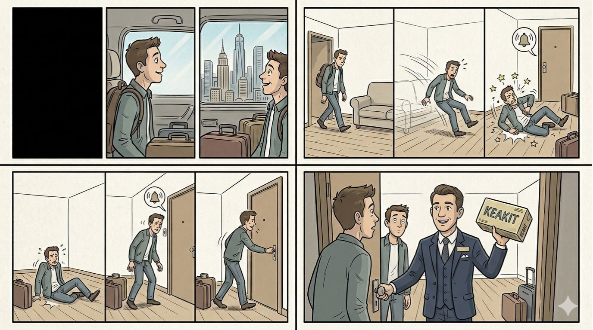
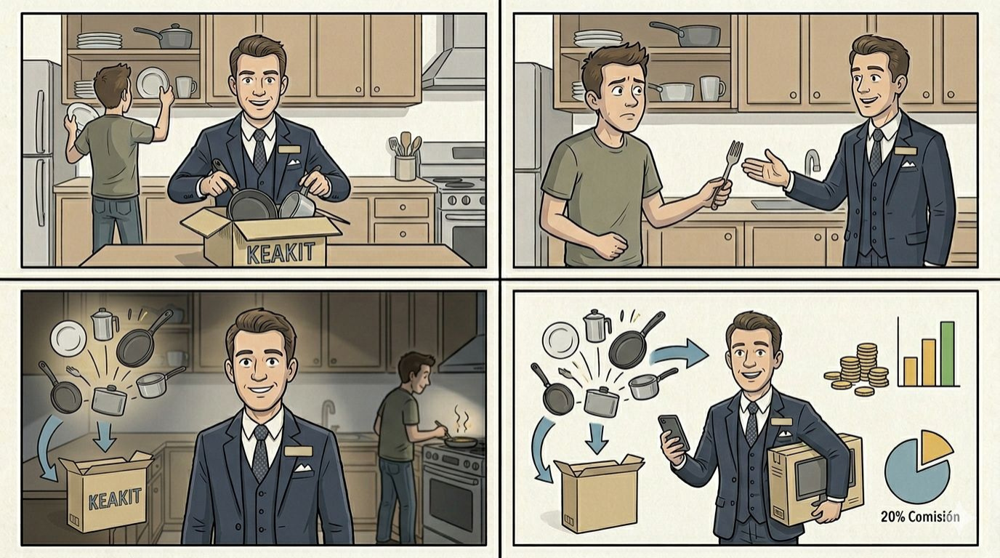
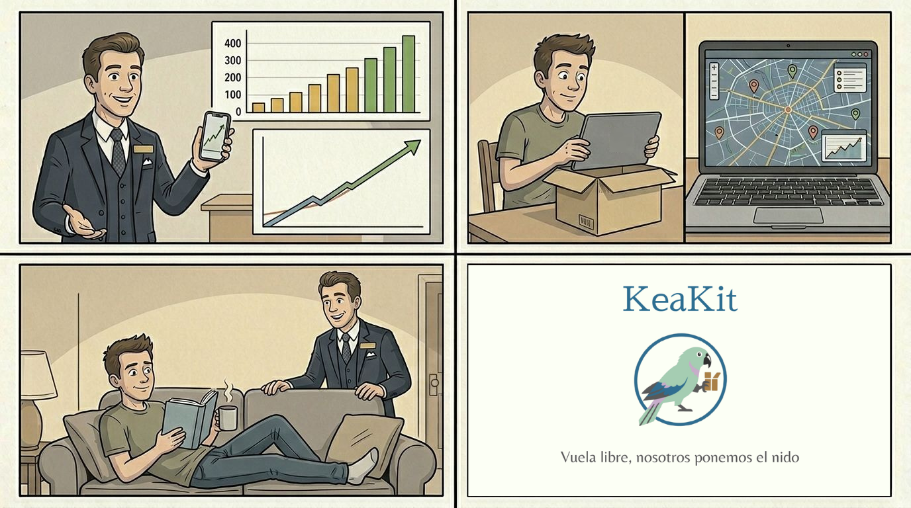

# Storyboard

## Índice del documento

1. [Visión General](#visión-general)
2. [Planos Detallados](#planos-detallados)
4. [Notas de Dirección](#notas-de-dirección)

---

## Visión General

**Concepto Principal:** Alguien trata de mudarse pero no tiene nada en su piso, rompiendo esto la magia de llegar a su destino soñado. Llaman a la puerta, es un repartidor de KeaKit. Este repartidor va explicando todo lo que respecta a la aplicación, su rentabilidad, la garantía...

**Tono:** Dinámico, asertivo, entretenido e informativo, pero sin caer en detalles muy técnicos.

**Duración aproximada:** 2-3 minutos.

**Mensaje clave:** KeaKit permite alquilar lo que no usas y que otros aprovechen lo que necesitan, reduciendo gastos y residuos. Además, es una aplicación rentable, pues funciona por comisiones en cada kit, no se hace cargo de la gestión física de los objetos y tiene muy bajos costes de mantenimiento.

---

## Planos Detallados

### PRIMER PLANO

| Elemento | Detalles |
|----------|----------|
| **Encuadre** | Empieza con una pantalla en negro. Secuencias del PROTAGONISTA llegando a una ciudad y admirando los edificios. |
| **Apariencia del personaje** | Persona normal, vestida de calle, con maletas. |
| **Diálogo** | _Voz en OFF_ **"Imagínese que se muda a la ciudad de sus sueños durante un tiempo. Todo es tal y como lo imaginó; los edificios que una vez apreciaba desde su imaginación, ahora los ve por la ventana. Llega a su nuevo hogar con ilusión, con ganas de disfrutar de un nuevo comienzo. Abre la puerta, va a sentarse en el sofá..."** |

---

### SEGUNDO PLANO

| Elemento | Detalles |
|----------|----------|
| **Encuadre** | Plano que muestre un salón con un sofá|
| **Apariencia del personaje** | Cansado |
| **Acción** | Suspira, va a sentarse tranquilamente en el sofá, pero el sofá (y el resto de cosas del salón, si las hubiere) acaba "desapareciendo" y se cae al suelo |
| **Sonido** | Golpe en el suelo, grito |
| **Diálogo** | _Voz en OFF_ **"...y resulta que no hay nada."** |

---

### TERCER PLANO

| Elemento | Detalles |
|----------|----------|
| **Encuadre** | Se enfoca al PROTAGONISTA en el suelo y se le sigue mientras anda hacia la puerta, mostrándole de espaldas en el último momento, la puerta de frente |
| **Efectos de sonido** | Timbre |
| **Acción** | Llaman a la puerta. El PROTAGONISTA se incorpora, mostrándose dolorido. El PROTAGONISTA anda hacia la puerta y la abre. |
| **Diálogo** | _(En OFF, justo después de que llamen a la puerta. Al momento de terminar de decir "KeaKit", debe abrirse la puerta)_ **"Claramente, no conocía KeaKit."** |

---

### CUARTO PLANO

| Elemento | Detalles |
|----------|----------|
| **Encuadre** | Se muestra al SPEAKER de frente justo antes de pasar adentro, sosteniendo una caja de KeaKit |
| **Acción** | El SPEAKER entra al piso, dejando al PROTAGONISTA desconcertado.|
| **Personaje** | El SPEAKER será el personaje encargado de comentar todos los aspectos técnicos en el anuncio. Se presenta en traje con una caja de KeaKit, sonriente. Habla a cámara mientras anda de frente. Al terminar de hablar, deja la caja en la encimera de la cocina. |
| **Diálogo** | _(SPEAKER)_ **"KeaKit es la plataforma de alquiler de objetos y servicios pensada para casos como este. Ahora, en lugar de visitar tiendas de cocina, muebles, electrodomésticos o proveedores de red por separado, puede hacerse con todos estos objetos o servicios desde la palma de su mano, en pocos segundos. Así, evitará desperdiciar dinero, quebrarse la cabeza con el qué hacer una vez no necesite estos productos, y estará contribuyendo con el medioambiente."**|

---

### QUINTO PLANO

| Elemento | Detalles |
|----------|----------|
| **Encuadre** | Plano con el SPEAKER enfocado en el centro. Es una cocina. Se ve al PROTAGONISTA en el fondo, desenfocado|
| **Acción** | Mientras el SPEAKER habla, va sacando cosas de la caja, sin dejar de mirar a cámara. El PROTAGONISTA las coge y va colocándolas en su sitio (sartenes, cazos, platos...) |
| **Diálogo** | _(SPEAKER)_ **"También funciona a la inversa. Si no necesita alquilar nada pero no le vendría mal ganar un dinero extra, puede poner sus productos o servicios a disposición del resto de usuarios de KeaKit. De esta forma, ahorra aprovechando lo que no utiliza en casa y ayuda a la comunidad."** |

---

### SEXTO PLANO

| Elemento | Detalles |
|----------|----------|
| **Encuadre** | Es una continuación del plano anterior, pero se enfoca al PROTAGONISTA |
| **Aspecto** | El PROTAGONISTA se muestra confundido |
| **Acción** | Con un tenedor en la mano, el PROTAGONISTA deja abruptamente de recolocar cosas en la cocina y se dirige al SPEAKER agitadamente |
| **Diálogo** | _(PROTAGONISTA)_ **"¿Pero, y si rompo algo? ¿O si tengo que ir yo a recoger todo esto por la ciudad?"** |
| **Acción II** | El SPEAKER le quita el tenedor de la mano y le responde |
| **Diálogo II** | _(PROTAGONISTA)_ **(SPEAKER) "Todo está bajo control. Implementamos un depósito de garantía del 20% para asegurar el buen estado. Y sobre la logística, tú eliges entre mensajería directa a tu puerta o punto de encuentro. Flexibilidad absoluta."** |

---

### SÉPTIMO PLANO

| Elemento | Detalles |
|----------|----------|
| **Encuadre** | Transición con un giro de cámara. Las luces del apartamento se atenúan un poco, desenfocando al PROTAGONISTA (que ahora se pone felizmente a cocinar con lo que tiene). La iluminación sobre el SPEAKER se vuelve más nítida, estilo escenario de presentación. |
| **Acción** | Habla el SPEAKER a cámara mientras el PROTAGONISTA cocina de fondo (efecto de sonido de sartén/cocina muy bajo)|
| **Diálogo** | _(SPEAKER)_ **"KeaKit soluciona un problema real para él... pero representa una oportunidad de negocio excepcional."** |

---

### OCTAVO PLANO

| Elemento | Detalles |
|----------|----------|
| **Encuadre** | Plano medio del SPEAKER. A su izquierda, aparecen artículos dinámicamente (se añaden suavemente uno a uno a la pantalla hasta formar un kit completo) y el número "240€" a la derecha. |
| **Acción** | El SPEAKER interactúa ligeramente con el gráfico con la mano, señalando a la derecha y apareciendo un "20% Comisión" bajo el 240€. |
| **Diálogo** | _(SPEAKER)_ **"Nuestro modelo de ingresos es directo, transparente y altamente escalable. Retenemos un 20% de comisión por cada kit alquilado. Sabiendo que el ticket medio de un kit es de unos 240 euros, estamos generando 48 euros por cada transacción, solo por intermediar."** |

---

### NOVENO PLANO

| Elemento | Detalles |
|----------|----------|
| **Encuadre** | La cámara se mueve lateralmente. El SPEAKER pasa a estar a la izquierda del plano|
| **Composición** | Se muestra la gráfica del número de usuarios piloto. Luego, la de rendimiento económico, con una flecha ascendente hacia "Break-even: Mes 9". |
| **Diálogo** | _(SPEAKER)_ **"Y no hablamos de suposiciones."** _(Mostrar la gráfica del crecimiento de usuarios piloto)_ **"Ya estamos validando el producto con usuarios piloto reales, demostrando una tendencia de crecimiento sólida".** _(Pasar a la gráfica del rendimiento económico)_ **"Con unos costes operativos extremadamente ligeros, proyectamos alcanzar el break-even con menos de 1.900 kits alquilados. Eso sería entre el noveno o décimo mes tras el lanzamiento."** |

---

### DÉCIMO PLANO

| Elemento | Detalles |
|----------|----------|
| **Encuadre** | Giro de cámara, se enfoca al PROTAGONISTA sacando un portátil (con el logo de KeaKit) de la caja mientras el SPEAKER habla. Se pasa a enfocar la pantalla del ordenador, que tiene un mapa tipo Google Earth y un sello de GDPR Compliance. |
| **Movimiento** | Plano estático. Zoom in lento pero constante cuando se enfoque al ordenador. |
| **Diálogo** | _(El SPEAKER no está en cámara, pero es el que habla. Se ve al PROTAGONISTA sacando y abriendo el ordenador)_ **"A partir de ese punto, el sistema es puro beneficio. Sin inventario propio que mantener."** _(Ahora es cuando se enseña la pantalla)_ **"Cumpliendo rigurosamente con la normativa GDPR. Con un efecto red donde cada nuevo usuario atrae a más oferta y demanda. Es la economía circular monetizada de la forma más eficiente posible."** |

---

### DECIMOPRIMER PLANO

| Elemento | Detalles |
|----------|----------|
| **Encuadre** | Se vuelve a la iluminación cálida del apartamento. El PROTAGONISTA está tumbado cómodamente en el sofá (el que "desapareció" en el plano 2), leyendo un libro y tomando un café. |
| **Acción** | El SPEAKER se sitúa detrás del sofá, apoyando una mano en el respaldo, mirando directamente a cámara. |
| **Diálogo** | **"En un mundo donde la movilidad, la flexibilidad y la sostenibilidad ya no son lujos, sino necesidades... KeaKit es la clave. Hacemos que cualquier lugar pueda sentirse como en casa mientras nos ayudamos entre nosotros y al medioambiente."** |

---

### DECIMOSEGUNDO PLANO

| Elemento | Detalles |
|----------|----------|
| **Encuadre** | Fundido a una pantalla beige (consultar Manual de Identidad Corporativa) con el logo de KeaKit y el eslogan "Vuela libre, nosotros ponemos el nido" |
| **Diálogo** | _(SPEAKER EN OFF)_**"KeaKit. Vuela libre, nosotros ponemos el nido."** |

---

## Notas de Dirección

### Ritmo

El ritmo del anuncio debe ser continuo, dinámico y que no dé lugar al aburrimiento, pero sin abrumar al espectador con giros innecesarios o frases muy rápidas. 

### Recursos y material a usar

- **Locaciones:** Salón, cocina
- **Vestuario:** El PROTAGONISTA debe vestir de ropa normal de calle, mientras el SPEAKER va de traje.
- **Materiales:** Sofá, caja con el logo de KeaKit, menaje de cocina (mínimo varias sartenes y un tenedor), portátil. 

---
## Storyboard

DISCLAIMER: El guión ha sido elaborado íntegramente a mano. Las imágenes pertenecientes al storyboard se han elaborado con inteligencia artificial (Nano Banana) a partir del guión. 

Las imágenes deben interpretarse de izquierda a derecha, empezando por las de arriba.

---
## Historial de Versiones

| Versión | Fecha | Autor | Cambios |
|---------|-------|-------|---------|
| 1.0 | 14/04/2026| Rosa María Espinosa Martínez | Versión inicial del storyboard completo |
| 1.1 | 14/04/2026| Rosa María Espinosa Martínez | Revisión de la versión anterior y adición de imágenes |

