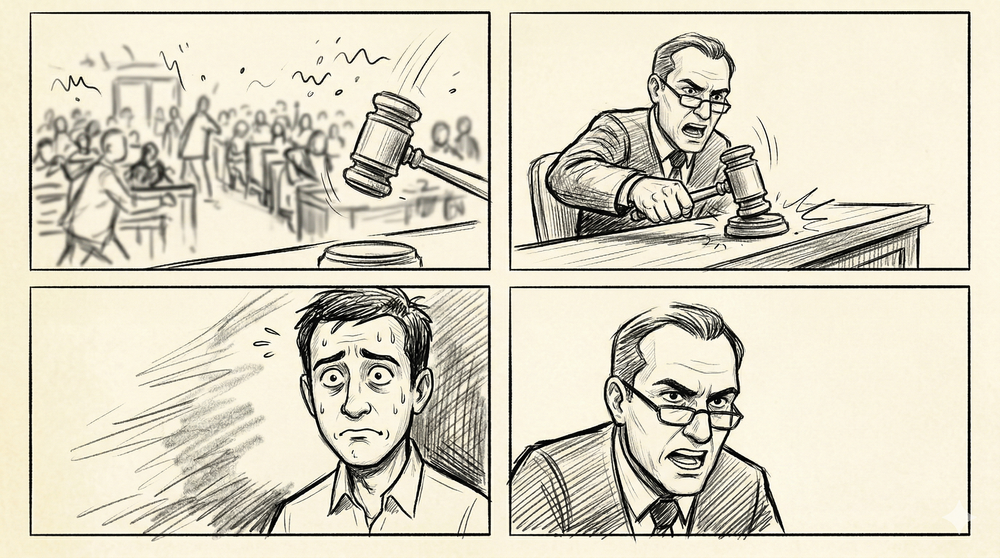
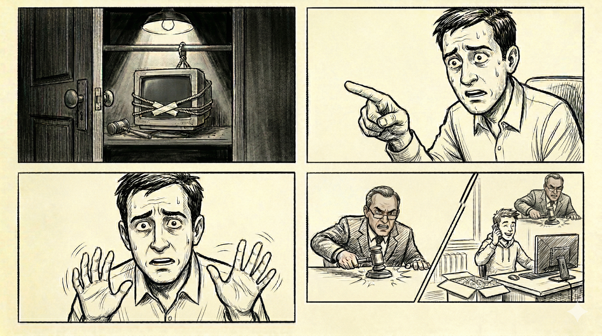
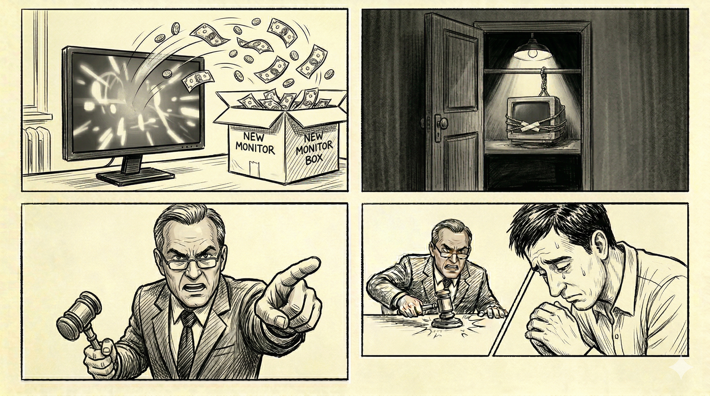
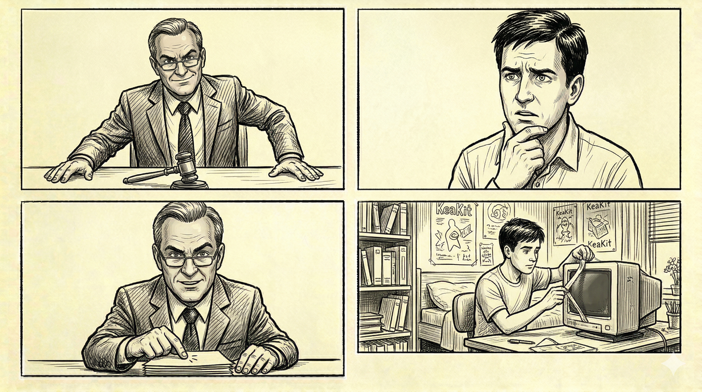
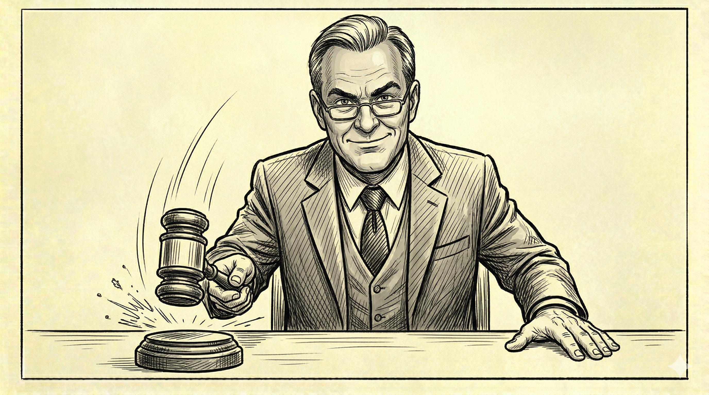

# Storyboard

## Índice del documento

1. [Visión General](#visión-general)
2. [Planos Detallados](#planos-detallados)
4. [Notas de Dirección](#notas-de-dirección)

---

## Visión General

**Concepto Principal:** Un juicio satírico que expone el problema y la solución que proporciona KeaKit.

**Tono:** Cómico, rápido.

**Duración aproximada:** 1 minuto.

**Mensaje clave:** KeaKit permite alquilar lo que no usas y que otros aprovechen lo que necesitan, reduciendo gastos y residuos.

---

## Planos Detallados

### INTRODUCCIÓN

**Descripción:** El video comienza con caos visual y sonoro.

- **Sonido:** Ruido de fondo intenso durante 1 segundo
- **Imagen:** Pantalla desenfocada, movimiento de personas en la tarima
- **Efecto:** La cámara se enfoca cuando el fiscal golpea la mesa
- **Transición:** Rápida y abrupta

---

### PRIMER PLANO

| Elemento | Detalles |
|----------|----------|
| **Encuadre** | Plano picado del FISCAL cerca de la cámara, ligeramente descentrado a la izquierda |
| **Enfoque** | Rápido y preciso |
| **Apariencia del personaje** | Gafas en la punta de la nariz, expresión seria e indignada |
| **Acción** | Golpea la mesa con un martillo |
| **Diálogo** | _(Gritando)_ **"¡Orden en la sala!"** |

---

### SEGUNDO PLANO

| Elemento | Detalles |
|----------|----------|
| **Encuadre** | Plano picado del ACUSADO, descentrado a la derecha, fondo desenfocado |
| **Enfoque** | Profundidad de campo reducida, solo el acusado en foco |
| **Apariencia del personaje** | Muy nervioso, sudor visible en la frente |
| **Acción** | Traga saliva |
| **Diálogo** | _(Sonido exagerado de tragar saliva)_ |

---

### TERCER PLANO

| Elemento | Detalles |
|----------|----------|
| **Encuadre** | Plano picado del FISCAL, descentrado a la izquierda |
| **Apariencia del personaje** | Igual que el primer plano |
| **Acción** | Habla acusando |
| **Diálogo** | _(Acusatorio)_ **"¡Se le acusa de secuestro… de un monitor!"**   **"¡Desde 2021!"** |

---

### CUARTO PLANO

| Elemento | Detalles |
|----------|----------|
| **Encuadre** | Puerta chirriante que se abre lentamente |
| **Composición** | Armario oscuro con luz cenital dramática desde arriba, iluminando al monitor |
| **Objeto** | Monitor viejo atado a un barrote con cuerdas, esparadrapo tapando la "boca" |
| **Efectos de sonido** | Gritos robóticos que se desvanecen con reverberación y fade out |
| **Atmósfera** | Dramática, casi terrorífica (ironía) |

---

### QUINTO PLANO

| Elemento | Detalles |
|----------|----------|
| **Encuadre** | Plano picado del ACUSADO desde la derecha |
| **Apariencia del personaje** | Nervioso, intentando justificarse |
| **Acción** | Señala hacia el armario (fuera de campo) |
| **Diálogo** | _(Defensivo)_ **"¡A ver, es que ese monitor…!"** |

---

### SEXTO PLANO

| Elemento | Detalles |
|----------|----------|
| **Encuadre** | Plano más cerrado del ACUSADO |
| **Aspecto** | Improvisando excusas, gesticulación rápida |
| **Acción** | Gesticula nerviosamente con las manos |
| **Diálogo** | _(Débil excusa)_ **"¡Ya no lo usaba nadie!"** |

---

### SÉPTIMO PLANO

| Elemento | Detalles |
|----------|----------|
| **Encuadre** | Plano frontal del FISCAL, más centrado que en planos anteriores |
| **Apariencia del personaje** | Indignación |
| **Acción** | Golpea la mesa con la mano con cada frase |
| **Diálogo** | _(Acusatorio)_ **"¡Y mientras tanto…!"** |

---

### OCTAVO PLANO

| Elemento | Detalles |
|----------|----------|
| **Encuadre** | Plano estilo sketch/comedia, ambiente desenfadado |
| **Personaje** | ESTUDIANTE ERASMUS feliz desempaquetando un monitor nuevo |
| **Accesorios** | Teléfono móvil en mano, caja del monitor |
| **Acción** | Conecta el monitor emocionado mientras habla por teléfono |
| **Diálogo** |  **ESTUDIANTE:** _(Entusiasmado)_ **"¡Me lo he comprado para este cuatri!"**  **MADRE:** _(Voz telefónica, fuera de cámara)_ **"¿Y luego qué haces con él?"** |

---

### NOVENO PLANO

| Elemento | Detalles |
|----------|----------|
| **Encuadre** | Plano con la caja del monitor, el monitor, billetes volando, iluminación baja |
| **Composición** | Dinero volando, caja del monitor, monitor encendido con efectos visuales |
| **Diálogo** | _(Voz del FISCAL (EN OFF))_ **"¡Duplicando gastos!"** |

---

### DÉCIMO PLANO

| Elemento | Detalles |
|----------|----------|
| **Encuadre** | Monitor viejo en el armario, cámara se aleja lentamente |
| **Movimiento** | Zoom out lento pero constante |
| **Atmósfera** | Retroceso a la oscuridad, aislamiento |
| **Diálogo** | _(Voz del FISCAL (EN OFF))_ **"¡Duplicando recursos!"** |

---

### DECIMOPRIMER PLANO

| Elemento | Detalles |
|----------|----------|
| **Encuadre** | Plano del FISCAL en el juicio |
| **Acción** | Señala al ACUSADO |
| **Diálogo** | **"¡Esto es un crimen contra la cartera y contra el planeta!"** |

---

### DECIMOSEGUNDO PLANO

| Elemento | Detalles |
|----------|----------|
| **Encuadre** | Plano del ACUSADO |
| **Apariencia del personaje** | Completamente derrotado, resignado |
| **Acción** | Se rinde, baja la cabeza |
| **Diálogo** | **"Vale… soy culpable. ¿A cuánto me condena?"** |

---

### DECIMOTERCER PLANO

| Elemento | Detalles |
|----------|----------|
| **Encuadre** | Plano del FISCAL, ahora centrado, cámara estable |
| **Iluminación** | Limpia, cambio dramático respecto a la dinámica anterior |
| **Apariencia del personaje** | Pequeña pausa, sonrisa pícara |
| **Acción** | Se apoya tranquilamente en la mesa |
| **Diálogo** | _(Pícaro)_ **"A ganar dinerito. Con KeaKit."** |

---

### DECIMOCUARTO PLANO

| Elemento | Detalles |
|----------|----------|
| **Encuadre** | Plano del ACUSADO |
| **Acción** | Frunce el ceño |
| **Diálogo** | _(Confundido)_ **"...¿Kea...qué?"** |

---

### DECIMOQUINTO PLANO

| Elemento | Detalles |
|----------|----------|
| **Encuadre** | Plano limpio del FISCAL mirando a cámara |
| **Iluminación** | Profesional, clara |
| **Diálogo** | **"KeaKit."** **"Alquilas lo que no usas…"** |

---

### DECIMOSEXTO PLANO

| Elemento | Detalles |
|----------|----------|
| **Encuadre** | Plano del ESTUDIANTE en su habitación (similar al octavo plano) |
| **Acción** | Quitándole el esparadrapo y las telarañas al monitor que estaba secuestrado |
| **Diálogo** | _(Voz del FISCAL (EN OFF))_ **"…y otros lo aprovechan."** |

---

### DECIMOSÉPTIMO PLANO

| Elemento | Detalles |
|----------|----------|
| **Encuadre** | Plano del FISCAL en el juicio |
| **Acción** | Golpe final del mazo |
| **Sonido** | Golpe del mazo |

### DECIMOCTAVO PLANO

| Elemento | Detalles |
|----------|----------|
| **Encuadre** | Logo de Keakit en la pantalla |
| **Acción** | GAparece justo después del golpe de mazo en el decimoséptimo plano |
| **Diálogo** | _(EN OFF, CON EL LOGO EN PANTALLA)_ **"KeaKit. Caso cerrado."** |

---

## Notas de Dirección

### Ritmo

Al principio (planos 1-7), las transiciones deben ser cortas, directas y directas, sin dejar tiempo apenas entre una escena y otra. A partir del plano 8, se baja un poco de ese ritmo frenético y acusatorio para enfatizar el problema y su solución.

### Recursos y material a usar

- **Locaciones:** Sala de juicios, armario/sótano oscuro, habitación de estudiante.
- **Vestuario:** FISCAL con toga/traje formal, ACUSADO en ropa casual, ESTUDIANTE en ropa deportiva.
- **Materiales:** Martillo de juez, monitor y su caja, papeles, teléfono móvil, billetes, cuerda, esparadrapo.

---
## Storyboard

DISCLAIMER: El guión ha sido elaborado a mano y formateado con inteligencia artificial a MarkDown. Las imágenes pertenecientes al storyboard se han elaborado con inteligencia artificial (Nano Banana) a partir del guión. 

Las imágenes deben interpretarse de izquierda a derecha, empezando por las de arriba. Se omite el último plano debido a que es una imagen del logo de KeaKit. 

---
## Historial de Versiones

| Versión | Fecha | Autor | Cambios |
|---------|-------|-------|---------|
| 1.0 | 08/04/2026| Rosa María Espinosa Martínez | Versión inicial del storyboard completo |
| 1.1 | 14/04/2026| Rosa María Espinosa Martínez | Actualización de las referencias de las imágenes |

